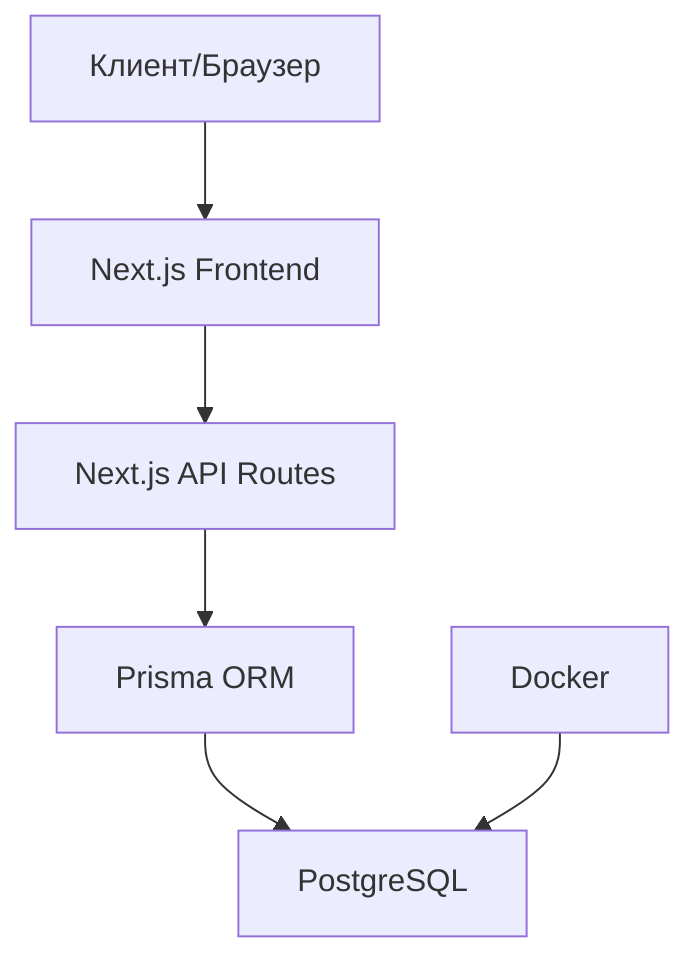
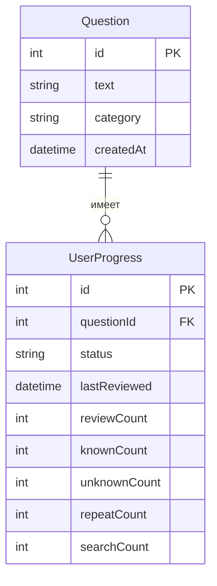

# TrenerFront - Приложение для подготовки к собеседованиям Frontend разработчика

Это приложение помогает подготовиться к собеседованиям на позицию Frontend разработчика, используя систему карточек с вопросами и отслеживанием прогресса.

## Содержание

- [Особенности](#особенности)
- [Технологии](#технологии)
- [Архитектура приложения](#архитектура-приложения)
- [Схема базы данных](#схема-базы-данных)
- [Установка и запуск](#установка-и-запуск)
- [Использование](#использование)
- [API эндпоинты](#api-эндпоинты)
- [Работа с вопросами](#работа-с-вопросами)
- [Скрипты](#скрипты)
- [Структура проекта](#структура-проекта)
- [Разработка и расширение](#разработка-и-расширение)

## Особенности

- Карточки с вопросами по Frontend разработке
- Три кнопки для отметки прогресса: "Повторить", "Знаю" и "Не знаю"
- Сохранение прогресса в базе данных
- Приоритизация вопросов, которые вы не знаете или хотите повторить
- Импорт вопросов из текстового файла
- Детальная статистика по каждому вопросу
- Возможность фильтрации вопросов по тегам

## Технологии

- **Frontend**: Next.js, React
- **Backend**: Next.js API Routes
- **База данных**: PostgreSQL (запускается в Docker)
- **ORM**: Prisma
- **Контейнеризация**: Docker и Docker Compose
- **Стили**: CSS Modules

## Архитектура приложения

Приложение построено на основе Next.js, который обеспечивает как клиентскую, так и серверную части:



- **Клиентская часть** отвечает за отображение карточек с вопросами и взаимодействие с пользователем
- **API Routes** обрабатывают запросы на получение вопросов и обновление прогресса
- **Prisma ORM** обеспечивает взаимодействие с базой данных
- **PostgreSQL** хранит вопросы и прогресс пользователя
- **Docker** используется для контейнеризации базы данных

## Схема базы данных



- **Question**: Хранит вопросы для собеседований
- **UserProgress**: Отслеживает прогресс пользователя по каждому вопросу

## Установка и запуск

### Предварительные требования

- Node.js (версия 14 или выше)
- Docker и Docker Compose

### Шаги установки

1. Клонируйте репозиторий:

```bash
git clone <url-репозитория>
cd TrenerFront
```

2. Установите зависимости:

```bash
npm install
```

3. Запустите базу данных PostgreSQL в Docker:

```bash
npm run docker:up
```

4. Настройте базу данных с помощью Prisma:

```bash
npm run db:setup
```

5. Импортируйте вопросы:

```bash
npm run db:import
```

6. Запустите приложение:

```bash
npm run dev
```

7. Откройте [http://localhost:3000](http://localhost:3000) в вашем браузере.

## Использование

1. Нажмите кнопку "Начать" на главной странице.
2. Вам будет показана карточка с вопросом.
3. Нажмите кнопку "Перевернуть", чтобы увидеть варианты ответов.
4. Выберите один из вариантов:
   - "Повторить" - если вы хотите вернуться к этому вопросу позже
   - "Знаю" - если вы знаете ответ на вопрос
   - "Не знаю" - если вы не знаете ответ на вопрос
5. При следующем запуске приложения вопросы, на которые вы ответили "Не знаю" или "Повторить", будут показаны в первую очередь.

## API эндпоинты

Приложение предоставляет следующие API эндпоинты:

- `GET /api/questions` - Получение списка вопросов

  - Параметры запроса:
    - `limit` - Количество вопросов (по умолчанию 10)
    - `category` - Фильтр по категории
    - `tag` - Фильтр по тегу
  - Пример: `/api/questions?limit=5&tag=Javascript`

- `GET /api/questions/:id` - Получение конкретного вопроса по ID

  - Пример: `/api/questions/42`

- `POST /api/progress` - Обновление прогресса по вопросу

  - Тело запроса:
    ```json
    {
      "questionId": 42,
      "status": "known" // "known", "unknown", "repeat"
    }
    ```

- `GET /api/progress` - Получение статистики прогресса
  - Пример ответа:
    ```json
    {
      "total": 100,
      "known": 30,
      "unknown": 20,
      "repeat": 10,
      "notReviewed": 40
    }
    ```

## Работа с вопросами

### Форматы файлов с вопросами

Приложение поддерживает два формата файлов с вопросами:

1. **Простой формат** (questions.txt):

   - Каждый вопрос на отдельной строке
   - Пример:
     ```
     Что такое замыкание в JavaScript?
     Объясните разницу между let, const и var в JavaScript.
     ```

2. **Расширенный формат** (txt):
   - Табличный формат с колонками: Шанс, Вопрос, Тег
   - Пример:
     ```
     Шанс	Вопрос	Тег
     96%	Расскажи о себе	Нет
     66%	Расскажи про event loop	Нет
     46%	Что такое замыкание	Javascript
     ```

### Импорт вопросов

Для импорта вопросов используйте следующие команды:

- Для простого формата:

  ```bash
  npm run import-questions
  ```

- Для расширенного формата:
  ```bash
  npm run import-extended
  ```

## Скрипты

В проекте доступны следующие npm-скрипты:

- `npm run dev` - Запуск приложения в режиме разработки
- `npm run build` - Сборка приложения для продакшена
- `npm run start` - Запуск собранного приложения
- `npm run lint` - Проверка кода с помощью ESLint

### Docker и база данных

- `npm run docker:up` - Запуск Docker контейнера с базой данных
- `npm run docker:down` - Остановка Docker контейнера
- `npm run db:setup` - Настройка базы данных (применение миграций)
- `npm run db:reset` - Сброс и пересоздание базы данных
- `npm run db:import` - Импорт вопросов из файла questions.txt
- `npm run db:import-extended` - Импорт вопросов из файла txt с расширенным форматом

## Структура проекта

```
TrenerFront/
├── components/         # React компоненты
│   └── QuestionCard.js # Компонент карточки вопроса
├── pages/              # Страницы Next.js и API-эндпоинты
│   ├── _app.js         # Корневой компонент приложения
│   ├── index.js        # Главная страница
│   └── api/            # API эндпоинты
│       ├── questions.js # API для работы с вопросами
│       └── progress.js  # API для работы с прогрессом
├── prisma/             # Схема базы данных Prisma
│   ├── schema.prisma   # Схема базы данных
│   └── migrations/     # Миграции базы данных
├── scripts/            # Скрипты для импорта вопросов и др.
│   ├── import-questions.js    # Импорт из простого формата
│   └── import-extended.js     # Импорт из расширенного формата
├── styles/             # CSS стили
├── .env                # Переменные окружения
├── docker-compose.yml  # Конфигурация Docker
├── package.json        # Зависимости и скрипты
└── README.md           # Документация
```

## Разработка и расширение

### Добавление новых функций

1. **Добавление новых типов вопросов**:

   - Обновите схему базы данных в `prisma/schema.prisma`
   - Создайте миграцию: `npx prisma migrate dev --name add_new_question_type`
   - Обновите компонент `QuestionCard.js` для отображения нового типа

2. **Добавление новых статистик**:

   - Обновите модель `UserProgress` в схеме Prisma
   - Создайте миграцию
   - Обновите API эндпоинт `/api/progress.js`

3. **Добавление фильтрации по тегам**:
   - Обновите API эндпоинт `/api/questions.js` для поддержки параметра `tag`
   - Добавьте UI компонент для выбора тега на главной странице

### Советы по разработке

- Используйте `npm run dev` для локальной разработки
- Проверяйте изменения в схеме базы данных с помощью `npx prisma studio`
- Для отладки API используйте инструменты разработчика в браузере или Postman
