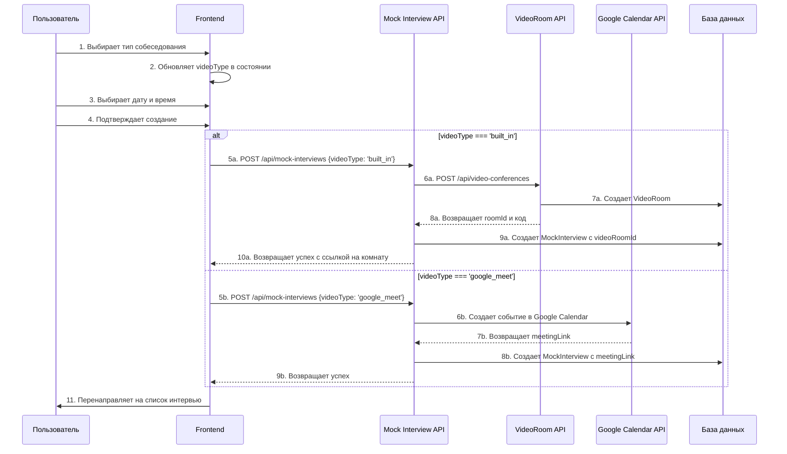

# Документация: Система выбора типа собеседования

## Обзор функциональности

Система выбора типа собеседования позволяет пользователям выбирать между двумя типами видеосвязи при создании mock-интервью:

1. **Google Meet** - Интеграция с Google Calendar и автоматическое создание ссылок
2. **Встроенная видеосистема** - Собственная WebRTC-система с расширенными возможностями

### Ключевые возможности

- ✅ Пошаговый интерфейс создания интервью
- ✅ Автоматическое создание видеокомнат для встроенной системы
- ✅ Интеграция с Google Calendar для Google Meet
- ✅ Fallback механизмы при ошибках
- ✅ Адаптивный дизайн для мобильных устройств
- ✅ Валидация данных на всех уровнях

## Архитектура решения

### Диаграмма компонентов

```
┌─────────────────────────────────────────────────────────────┐
│                    Frontend Layer                           │
├─────────────────────────────────────────────────────────────┤
│  pages/mock-interviews/new.js                               │
│  ├── InterviewTypeSelector (Шаг 0)                         │
│  ├── InterviewCalendar (Шаг 1)                             │
│  ├── Confirmation (Шаг 2)                                  │
│  └── ManualLinkInput (Шаг 3 - fallback)                    │
└─────────────────────────────────────────────────────────────┘
                              │
                              ▼
┌─────────────────────────────────────────────────────────────┐
│                     API Layer                               │
├─────────────────────────────────────────────────────────────┤
│  /api/mock-interviews/index.js                              │
│  ├── POST: Создание интервью                               │
│  ├── GET: Получение списка интервью                        │
│  └── Валидация videoType                                   │
└─────────────────────────────────────────────────────────────┘
                              │
                    ┌─────────┴─────────┐
                    ▼                   ▼
┌─────────────────────────┐    ┌─────────────────────────┐
│   Google Calendar API   │    │   VideoRoom API         │
│                         │    │                         │
│  ├── createCalendarEvent│    │  ├── POST /api/video-   │
│  ├── Google Meet links  │    │  │   conferences        │
│  └── Event management   │    │  ├── Room creation      │
└─────────────────────────┘    │  └── Participant mgmt   │
                               └─────────────────────────┘
                                          │
                                          ▼
┌─────────────────────────────────────────────────────────────┐
│                   Database Layer                            │
├─────────────────────────────────────────────────────────────┤
│  MockInterview                                              │
│  ├── videoType: 'google_meet' | 'built_in'                 │
│  ├── videoRoomId: связь с VideoRoom                        │
│  ├── calendarEventId: ID события Google Calendar           │
│  └── meetingLink: ссылка на встречу                        │
│                                                             │
│  VideoRoom                                                  │
│  ├── code: уникальный код комнаты                          │
│  ├── isPrivate: true для интервью                          │
│  ├── maxParticipants: 2 для интервью                       │
│  └── settings: конфигурация комнаты                        │
└─────────────────────────────────────────────────────────────┘
```

### Поток данных



## Инструкции по использованию

### Для пользователей

1. **Создание интервью:**

   - Перейдите на `/mock-interviews/new`
   - Выберите тип собеседования (Google Meet или встроенная система)
   - Укажите дату и время
   - Подтвердите создание

2. **Типы собеседований:**

   **Google Meet:**

   - Автоматическое создание ссылки
   - Интеграция с Google Calendar
   - Знакомый интерфейс
   - Высокое качество связи

   **Встроенная видеосистема:**

   - Полный контроль над процессом
   - Встроенная запись
   - Чат и совместное использование экрана
   - Специальные функции для интервью

3. **Участие в интервью:**
   - Google Meet: переход по ссылке из календаря или списка интервью
   - Встроенная система: переход в видеокомнату через платформу

### Для разработчиков

#### Добавление нового типа видеосвязи

1. Обновите enum в компоненте `InterviewTypeSelector`:

```javascript
const interviewTypes = [
  // существующие типы...
  {
    id: 'new_type',
    title: 'Новый тип',
    description: 'Описание нового типа',
    icon: '🎯',
    features: ['Функция 1', 'Функция 2'],
    color: '#ff6b6b',
  },
];
```

2. Добавьте обработку в API `pages/api/mock-interviews/index.js`:

```javascript
// Валидация
if (!['google_meet', 'built_in', 'new_type'].includes(videoType)) {
  return res.status(400).json({
    message: 'Недопустимый тип видеосвязи',
  });
}

// Обработка нового типа
if (videoType === 'new_type') {
  // Логика для нового типа
}
```

3. Обновите схему базы данных при необходимости

## API Документация

### POST /api/mock-interviews

Создание нового mock-интервью с выбранным типом видеосвязи.

#### Параметры запроса

```json
{
  "scheduledTime": "2025-05-30T15:00:00.000Z",
  "videoType": "google_meet" | "built_in",
  "manualMeetingLink": "https://meet.google.com/xxx-xxxx-xxx" // опционально
}
```

#### Параметры ответа (успех)

```json
{
  "id": "cm123456789",
  "scheduledTime": "2025-05-30T15:00:00.000Z",
  "meetingLink": "https://meet.google.com/xxx-xxxx-xxx",
  "videoType": "google_meet",
  "status": "pending",
  "calendarEventId": "event_123",
  "videoRoomId": null,
  "isManualLink": false
}
```

#### Параметры ответа (ошибка - требуется ручная ссылка)

```json
{
  "message": "Не удалось автоматически создать ссылку на Google Meet",
  "needManualLink": true,
  "isAuthError": false,
  "error": "Детали ошибки"
}
```

### GET /api/mock-interviews

Получение списка интервью с фильтрацией по статусу.

#### Параметры запроса

- `status` (опционально): `active` | `archived`

#### Параметры ответа

```json
[
  {
    "id": "cm123456789",
    "scheduledTime": "2025-05-30T15:00:00.000Z",
    "meetingLink": "https://meet.google.com/xxx-xxxx-xxx",
    "videoType": "google_meet",
    "status": "pending",
    "isCreatedByCurrentUser": true,
    "interviewer": {
      "id": "user123",
      "name": "Иван Иванов",
      "email": "ivan@example.com",
      "image": "https://example.com/avatar.jpg"
    },
    "videoRoom": null
  }
]
```

## Примеры запросов

### Создание интервью с Google Meet

```bash
curl -X POST http://localhost:3000/api/mock-interviews \
  -H "Content-Type: application/json" \
  -H "Cookie: next-auth.session-token=..." \
  -d '{
    "scheduledTime": "2025-05-30T15:00:00.000Z",
    "videoType": "google_meet"
  }'
```

### Создание интервью со встроенной видеосистемой

```bash
curl -X POST http://localhost:3000/api/mock-interviews \
  -H "Content-Type: application/json" \
  -H "Cookie: next-auth.session-token=..." \
  -d '{
    "scheduledTime": "2025-05-30T15:00:00.000Z",
    "videoType": "built_in"
  }'
```

### Создание интервью с ручной ссылкой

```bash
curl -X POST http://localhost:3000/api/mock-interviews \
  -H "Content-Type: application/json" \
  -H "Cookie: next-auth.session-token=..." \
  -d '{
    "scheduledTime": "2025-05-30T15:00:00.000Z",
    "videoType": "google_meet",
    "manualMeetingLink": "https://meet.google.com/abc-defg-hij"
  }'
```

## Troubleshooting Guide

### Проблема: Не удается создать ссылку Google Meet

**Симптомы:**

- Ошибка "Не удалось автоматически создать ссылку на Google Meet"
- Переход на шаг ручного ввода ссылки

**Возможные причины:**

1. Проблемы с авторизацией Google
2. Недостаточные права доступа к Google Calendar API
3. Превышение лимитов API

**Решения:**

1. Проверьте настройки Google OAuth в `.env`
2. Убедитесь, что пользователь авторизован в Google
3. Используйте ручной ввод ссылки как временное решение
4. Проверьте логи сервера для детальной информации

### Проблема: Не создается встроенная видеокомната

**Симптомы:**

- Ошибка при создании интервью с типом `built_in`
- Автоматический fallback на Google Meet

**Возможные причины:**

1. Недоступность VideoRoom API
2. Ошибки в конфигурации видеосистемы
3. Проблемы с базой данных

**Решения:**

1. Проверьте статус VideoRoom API: `GET /api/video-conferences`
2. Убедитесь, что все миграции базы данных выполнены
3. Проверьте логи сервера для детальной диагностики

### Проблема: Неправильное отображение типа интервью

**Симптомы:**

- Интервью отображается с неправильным типом
- Отсутствует информация о видеокомнате

**Возможные причины:**

1. Несоответствие данных в базе
2. Ошибки в логике отображения

**Решения:**

1. Проверьте поле `videoType` в базе данных
2. Убедитесь, что связи `videoRoomId` корректны
3. Обновите кэш браузера

### Проблема: Ошибки валидации

**Симптомы:**

- Ошибка "Недопустимый тип видеосвязи"
- Блокировка создания интервью

**Возможные причины:**

1. Передача неподдерживаемого значения `videoType`
2. Отсутствие обязательных полей

**Решения:**

1. Убедитесь, что `videoType` имеет значение `google_meet` или `built_in`
2. Проверьте, что все обязательные поля заполнены
3. Проверьте формат даты и времени

## Мониторинг и логирование

### Ключевые метрики

1. **Успешность создания интервью по типам:**

   - Google Meet: процент успешных автоматических созданий
   - Built-in: процент успешных созданий видеокомнат

2. **Использование fallback механизмов:**

   - Частота перехода на ручной ввод ссылок
   - Частота fallback с built-in на Google Meet

3. **Производительность:**
   - Время создания видеокомнат
   - Время создания событий Google Calendar

### Логирование

Все ключевые операции логируются в консоль сервера:

```javascript
// Примеры логов
console.log('API: Обработка типа видеосвязи:', videoType);
console.log('API: Видеокомната создана успешно:', { roomId, roomCode });
console.log('API: Собеседование создано успешно:', { id, videoType });
```

## Безопасность

### Валидация данных

1. **Frontend валидация:**

   - Проверка выбора типа собеседования
   - Валидация формата ссылок Google Meet
   - Проверка корректности даты и времени

2. **Backend валидация:**
   - Проверка допустимых значений `videoType`
   - Валидация формата даты
   - Проверка авторизации пользователя

### Права доступа

1. **Создание интервью:** только авторизованные пользователи
2. **Видеокомнаты:** приватные комнаты с ограничением на 2 участника
3. **Google Calendar:** доступ только к собственным событиям

## Производительность

### Оптимизации

1. **Кэширование:** результаты API запросов кэшируются на уровне браузера
2. **Lazy loading:** компоненты загружаются по требованию
3. **Минимизация запросов:** объединение операций создания

### Рекомендации

1. Используйте встроенную видеосистему для лучшего контроля
2. Настройте мониторинг Google API лимитов
3. Регулярно очищайте неиспользуемые видеокомнаты

---

**Дата создания:** 30.05.2025  
**Версия:** 1.0.0  
**Автор:** Roo (Code Mode)  
**Статус:** Готово к использованию
