# План создания документации по исправлениям скриптов деплоя с Prisma

## 1. Структура документации

```mermaid
graph TD
    A[Документация по исправлениям скриптов деплоя с Prisma] --> B[1. Введение]
    A --> C[2. Анализ проблемы]
    A --> D[3. Внесенные исправления]
    A --> E[4. Инструкции по использованию]
    A --> F[5. Возможные проблемы и их решения]
    A --> G[6. Рекомендации по обновлению Prisma]

    B --> B1[Описание проблемы]
    B --> B2[Цели исправлений]

    C --> C1[Ошибка с модулем @prisma/engines]
    C --> C2[Несоответствие версий Prisma]
    C --> C3[Проблемы с package.json]
    C --> C4[Ограничения по памяти на сервере]

    D --> D1[Исправления в fix_prisma_server_lowmem.sh]
    D --> D2[Исправления в deploy_with_prisma_fix_lowmem.sh]

    D1 --> D1a[Автоматическое определение версии Prisma]
    D1 --> D1b[Улучшение создания заглушки для @prisma/engines]
    D1 --> D1c[Проверка работоспособности заглушки]

    D2 --> D2a[Улучшение обработки package.json]
    D2 --> D2b[Проверка соответствия версий]
    D2 --> D2c[Улучшение процесса копирования файлов]
    D2 --> D2d[Улучшение обработки ошибок]

    E --> E1[Использование fix_prisma_server_lowmem.sh]
    E --> E2[Использование deploy_with_prisma_fix_lowmem.sh]

    F --> F1[Проблемы с памятью]
    F --> F2[Проблемы с версиями Prisma]
    F --> F3[Проблемы с модулем @prisma/engines]

    G --> G1[Обновление версии Prisma в package.json]
    G --> G2[Обновление версии в скриптах]
```

## 2. Содержание разделов документации

### 2.1. Введение

- Краткое описание проблемы с Prisma при деплое
- Цели внесенных исправлений
- Обзор улучшенных скриптов

### 2.2. Анализ проблемы

- Детальное описание ошибки с модулем @prisma/engines
- Анализ несоответствия версий Prisma в package.json и скриптах
- Проблемы с дублированием зависимости "prisma" в package.json
- Ограничения по памяти на сервере и их влияние на работу Prisma

### 2.3. Внесенные исправления

- **Исправления в fix_prisma_server_lowmem.sh**:

  - Автоматическое определение версии Prisma из package.json
  - Улучшение создания заглушки для @prisma/engines
  - Добавление проверки работоспособности заглушки
  - Создание swap-файла для увеличения доступной памяти

- **Исправления в deploy_with_prisma_fix_lowmem.sh**:
  - Улучшение обработки package.json (резервные копии, проверка валидности)
  - Проверка соответствия версий Prisma в package.json и скриптах
  - Улучшение процесса копирования файлов на сервер
  - Улучшение обработки ошибок при выполнении скриптов

### 2.4. Инструкции по использованию

- Пошаговые инструкции по использованию fix_prisma_server_lowmem.sh
- Пошаговые инструкции по использованию deploy_with_prisma_fix_lowmem.sh
- Примеры использования скриптов в различных сценариях

### 2.5. Возможные проблемы и их решения

- Проблемы с памятью на сервере и способы их решения
- Проблемы с версиями Prisma и их совместимостью
- Проблемы с модулем @prisma/engines и способы их решения
- Другие возможные проблемы и рекомендации по их устранению

### 2.6. Рекомендации по обновлению Prisma

- Рекомендации по обновлению версии Prisma в package.json
- Рекомендации по обновлению версии Prisma в скриптах
- Проверки совместимости при обновлении Prisma

## 3. Формат и стиль документации

- Документация будет создана в формате Markdown
- Будут использованы заголовки, списки, блоки кода и таблицы для лучшей читаемости
- Примеры кода будут выделены соответствующими блоками
- Важные моменты будут выделены жирным шрифтом или блоками предупреждений

## 4. Процесс создания документации

1. Создание структуры документа с основными разделами
2. Наполнение разделов содержимым на основе анализа скриптов
3. Добавление примеров использования и решения проблем
4. Форматирование и проверка документации
5. Сохранение документации в файл Markdown
