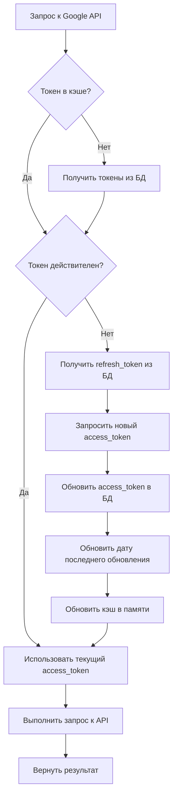
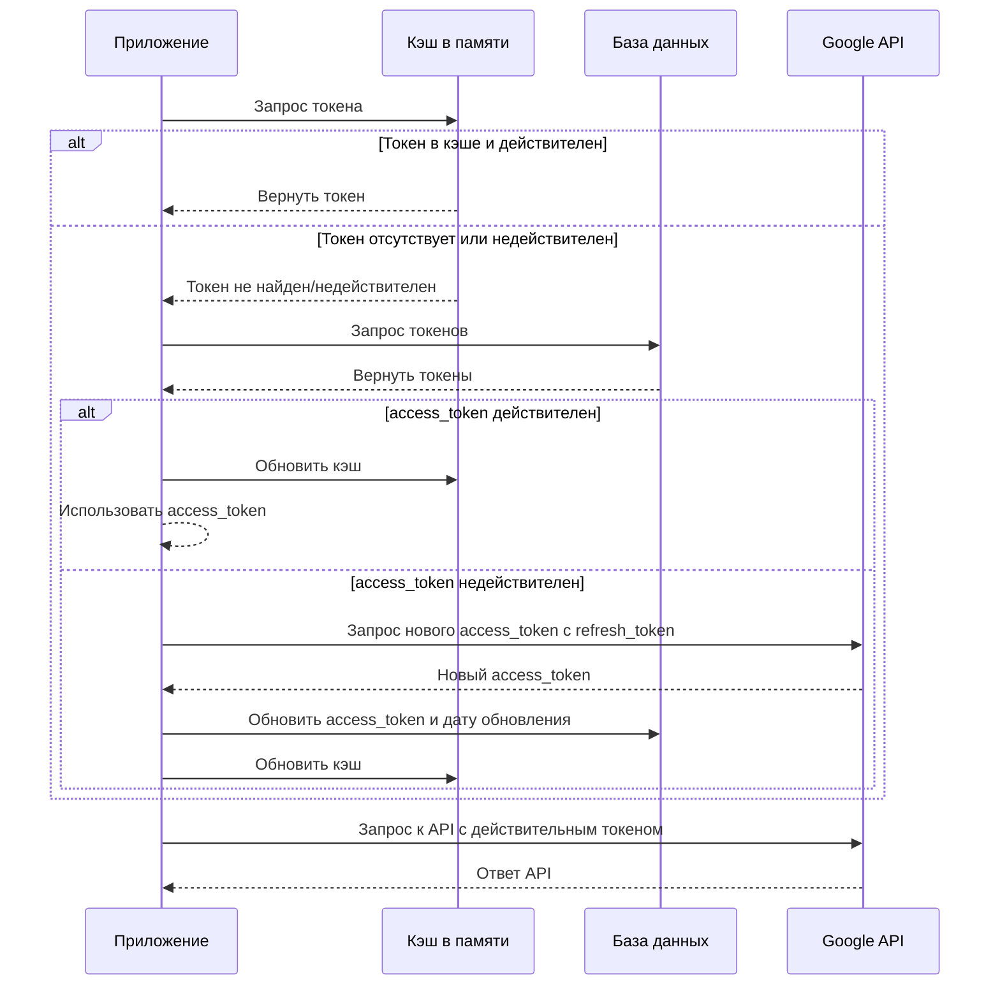
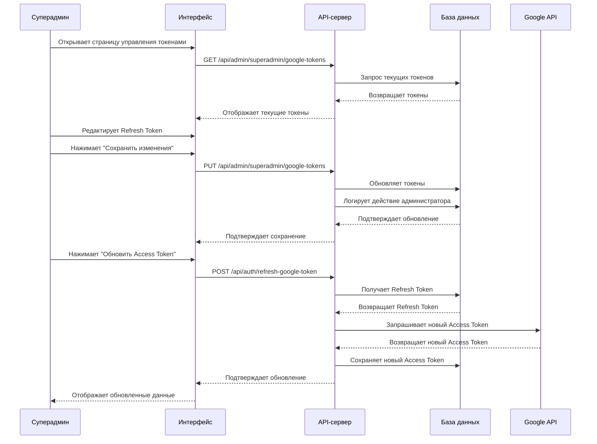

# Решение проблемы с обновлением GOOGLE_REFRESH_TOKEN

## Анализ текущей ситуации

### Проблемы

1. **Отсутствие автоматического обновления Refresh Token**:

   - Refresh token не обновляется автоматически, что приводит к необходимости часто обновлять `GOOGLE_REFRESH_TOKEN` в файлах `.env.local` и `.env.production`
   - Функция `updateEnvFile` обновляет только `GOOGLE_ACCESS_TOKEN` и `GOOGLE_TOKEN_EXPIRY`, но не `GOOGLE_REFRESH_TOKEN`

2. **Разрыв между двумя механизмами работы с Google API**:

   - Refresh token, полученный при аутентификации пользователя через NextAuth.js, сохраняется в базе данных, но не используется для обновления переменной окружения `GOOGLE_REFRESH_TOKEN`
   - Нет кода, который бы извлекал refresh token из базы данных и использовал его для работы с Google Calendar API

3. **Проблемы с форматом данных**:

   - В файле `.env.local` значение `GOOGLE_TOKEN_EXPIRY` установлено как `NaN`, что может вызывать проблемы при проверке срока действия токена
   - В файле `.env.production` значение `GOOGLE_TOKEN_EXPIRY` установлено как `1747483200000`

4. **Отсутствие механизма обработки истечения Refresh Token**:
   - Нет механизма, который бы уведомлял администратора о необходимости обновить refresh token
   - Нет автоматического механизма получения нового refresh token при его истечении

### Текущая архитектура

В текущей архитектуре:

1. Токены хранятся в двух местах:

   - В базе данных в таблице `Account` (поля `refresh_token` и `access_token`)
   - В файлах окружения (`.env.local` и `.env.production`) как переменные `GOOGLE_ACCESS_TOKEN`, `GOOGLE_REFRESH_TOKEN` и `GOOGLE_TOKEN_EXPIRY`

2. Функция `refreshTokenIfNeeded` в файле `lib/utils/tokenRefresher.js` обновляет только `GOOGLE_ACCESS_TOKEN` и `GOOGLE_TOKEN_EXPIRY` в файле `.env.local`, но не обновляет `GOOGLE_REFRESH_TOKEN`.

3. Для создания встреч в Google Calendar используется единый сервисный аккаунт для всего приложения, а не аккаунты отдельных пользователей.

## Предлагаемое решение

Учитывая требование минимизации изменений в коде, предлагается следующее решение:

1. **Хранить токены сервисного аккаунта в базе данных**:

   - Добавить модель `ServiceAccount` в схему Prisma для хранения токенов сервисного аккаунта
   - Хранить `refresh_token`, `access_token`, `expiry_date` и дату последнего обновления в этой таблице
   - Мигрировать существующие токены из `.env` файлов в базу данных

2. **Модифицировать механизм обновления токенов**:

   - Изменить функцию `refreshTokenIfNeeded` для работы с базой данных вместо `.env` файлов
   - Добавить механизм кэширования токенов в памяти для повышения производительности
   - Обновлять `access_token` и дату последнего обновления в базе данных при получении нового токена

3. **Обеспечить обратную совместимость**:
   - Сохранить поддержку переменных окружения для плавного перехода
   - Добавить механизм автоматической миграции токенов из `.env` в базу данных при первом запуске

## Диаграмма потока данных



## Диаграмма процесса обновления токенов



## Изменения в схеме базы данных

Добавить модель `ServiceAccount` в `prisma/schema.prisma`:

```prisma
model ServiceAccount {
  id                String   @id @default(cuid())
  provider          String   // "google"
  clientId          String
  clientSecret      String
  refreshToken      String   @db.Text
  accessToken       String?  @db.Text
  expiryDate        DateTime?
  lastUpdated       DateTime @default(now()) // Дата последнего обновления access_token
  createdAt         DateTime @default(now())
  updatedAt         DateTime @updatedAt
}
```

## Модификации в коде

### 1. Модификация `lib/utils/tokenRefresher.js`

```javascript
const { google } = require('googleapis');
const prisma = require('../../lib/prisma');

// Кэш для токенов в памяти
let tokenCache = {
  accessToken: null,
  expiryDate: null,
};

/**
 * Получает сервисный аккаунт из базы данных
 * @returns {Promise<Object>} - Объект сервисного аккаунта
 */
async function getServiceAccount() {
  // Получаем сервисный аккаунт из базы данных
  let serviceAccount = await prisma.serviceAccount.findFirst({
    where: { provider: 'google' },
  });

  // Если сервисный аккаунт не найден, создаем его из переменных окружения
  if (!serviceAccount) {
    console.log('Сервисный аккаунт не найден, создаем из переменных окружения');
    serviceAccount = await prisma.serviceAccount.create({
      data: {
        provider: 'google',
        clientId: process.env.GOOGLE_CLIENT_ID,
        clientSecret: process.env.GOOGLE_CLIENT_SECRET,
        refreshToken: process.env.GOOGLE_REFRESH_TOKEN,
        accessToken: process.env.GOOGLE_ACCESS_TOKEN,
        expiryDate: new Date(parseInt(process.env.GOOGLE_TOKEN_EXPIRY || '0')),
        lastUpdated: new Date(),
      },
    });
    console.log('Сервисный аккаунт создан:', serviceAccount.id);
  }

  return serviceAccount;
}

/**
 * Обновляет токен при необходимости
 * @param {Object} options - Параметры
 * @param {number} options.expiryThreshold - Порог в секундах, при котором токен считается "скоро истекающим"
 * @returns {Promise<Object>} - Объект с токенами
 */
async function refreshTokenIfNeeded(options = { expiryThreshold: 300 }) {
  const currentTime = Date.now();

  // Проверяем кэш в памяти
  if (
    tokenCache.accessToken &&
    tokenCache.expiryDate &&
    tokenCache.expiryDate > currentTime + options.expiryThreshold * 1000
  ) {
    console.log('Используем токен из кэша в памяти');
    return {
      access_token: tokenCache.accessToken,
      refresh_token: null, // Не возвращаем refresh_token для безопасности
      expiry_date: tokenCache.expiryDate,
    };
  }

  // Получаем сервисный аккаунт из базы данных
  const serviceAccount = await getServiceAccount();

  // Проверяем, истекает ли токен в ближайшее время
  const expiryDate = serviceAccount.expiryDate
    ? serviceAccount.expiryDate.getTime()
    : 0;
  const thresholdTime = currentTime + options.expiryThreshold * 1000;

  // Если токен отсутствует или скоро истечет, обновляем его
  if (
    !serviceAccount.accessToken ||
    !expiryDate ||
    expiryDate < thresholdTime
  ) {
    console.log('Токен отсутствует или скоро истечет, обновляем...');

    // Проверяем наличие refresh токена
    if (!serviceAccount.refreshToken) {
      throw new Error('Отсутствует refresh_token. Невозможно обновить токен.');
    }

    const oauth2Client = new google.auth.OAuth2(
      serviceAccount.clientId,
      serviceAccount.clientSecret,
      process.env.GOOGLE_REDIRECT_URI
    );

    // Устанавливаем refresh_token для получения нового access_token
    oauth2Client.setCredentials({
      refresh_token: serviceAccount.refreshToken,
    });

    try {
      // Запрашиваем новый токен
      const { credentials } = await oauth2Client.refreshAccessToken();

      // Вычисляем время истечения
      const newExpiryTime = Date.now() + credentials.expires_in * 1000;

      // Обновляем запись в базе данных
      await prisma.serviceAccount.update({
        where: { id: serviceAccount.id },
        data: {
          accessToken: credentials.access_token,
          expiryDate: new Date(newExpiryTime),
          lastUpdated: new Date(),
          updatedAt: new Date(),
        },
      });

      console.log('Токен успешно обновлен в базе данных');

      // Обновляем кэш в памяти
      tokenCache.accessToken = credentials.access_token;
      tokenCache.expiryDate = newExpiryTime;

      return {
        access_token: credentials.access_token,
        refresh_token: serviceAccount.refreshToken,
        expiry_date: newExpiryTime,
      };
    } catch (error) {
      console.error('Ошибка при обновлении токена:', error);

      // Если ошибка связана с недействительным refresh_token, логируем это
      if (error.message.includes('invalid_grant')) {
        console.error(
          'Refresh token недействителен. Требуется повторная авторизация.'
        );
        // Здесь можно добавить код для отправки уведомления администратору
      }

      throw error;
    }
  }

  // Обновляем кэш в памяти
  tokenCache.accessToken = serviceAccount.accessToken;
  tokenCache.expiryDate = expiryDate;

  // Если токен еще действителен, возвращаем текущие значения
  return {
    access_token: serviceAccount.accessToken,
    refresh_token: serviceAccount.refreshToken,
    expiry_date: expiryDate,
  };
}

/**
 * Получает настроенный OAuth2 клиент с актуальными токенами
 * @returns {Promise<OAuth2Client>} - Настроенный OAuth2 клиент
 */
async function getAuthenticatedOAuth2Client() {
  try {
    // Обновляем токен при необходимости
    const tokens = await refreshTokenIfNeeded();

    // Получаем сервисный аккаунт из базы данных
    const serviceAccount = await getServiceAccount();

    // Создаем OAuth2 клиент
    const oauth2Client = new google.auth.OAuth2(
      serviceAccount.clientId,
      serviceAccount.clientSecret,
      process.env.GOOGLE_REDIRECT_URI
    );

    // Устанавливаем токены
    oauth2Client.setCredentials({
      access_token: tokens.access_token,
      refresh_token: tokens.refresh_token,
      expiry_date: tokens.expiry_date,
    });

    return oauth2Client;
  } catch (error) {
    console.error('Ошибка при получении OAuth2 клиента:', error);

    // Пробуем использовать переменные окружения как запасной вариант
    console.log(
      'Пробуем использовать переменные окружения как запасной вариант'
    );

    const oauth2Client = new google.auth.OAuth2(
      process.env.GOOGLE_CLIENT_ID,
      process.env.GOOGLE_CLIENT_SECRET,
      process.env.GOOGLE_REDIRECT_URI
    );

    if (process.env.GOOGLE_ACCESS_TOKEN) {
      oauth2Client.setCredentials({
        access_token: process.env.GOOGLE_ACCESS_TOKEN,
        refresh_token: process.env.GOOGLE_REFRESH_TOKEN,
        expiry_date: parseInt(process.env.GOOGLE_TOKEN_EXPIRY || '0', 10),
      });
    }

    return oauth2Client;
  }
}

module.exports = {
  refreshTokenIfNeeded,
  getAuthenticatedOAuth2Client,
  getServiceAccount,
};
```

### 2. Скрипт для миграции токенов из `.env` в базу данных

```javascript
// scripts/migrate-tokens-to-db.js
const { PrismaClient } = require('@prisma/client');
const prisma = new PrismaClient();

async function migrateTokensToDB() {
  try {
    console.log('Начинаем миграцию токенов из .env в базу данных...');

    // Проверяем, существует ли уже сервисный аккаунт
    const existingAccount = await prisma.serviceAccount.findFirst({
      where: { provider: 'google' },
    });

    if (existingAccount) {
      console.log('Сервисный аккаунт уже существует в базе данных');
      console.log('ID:', existingAccount.id);
      console.log('Provider:', existingAccount.provider);
      console.log('Last Updated:', existingAccount.lastUpdated);
      return;
    }

    // Проверяем наличие необходимых переменных окружения
    if (
      !process.env.GOOGLE_CLIENT_ID ||
      !process.env.GOOGLE_CLIENT_SECRET ||
      !process.env.GOOGLE_REFRESH_TOKEN
    ) {
      console.error('Отсутствуют необходимые переменные окружения');
      console.error('GOOGLE_CLIENT_ID:', !!process.env.GOOGLE_CLIENT_ID);
      console.error(
        'GOOGLE_CLIENT_SECRET:',
        !!process.env.GOOGLE_CLIENT_SECRET
      );
      console.error(
        'GOOGLE_REFRESH_TOKEN:',
        !!process.env.GOOGLE_REFRESH_TOKEN
      );
      return;
    }

    // Создаем сервисный аккаунт из переменных окружения
    const serviceAccount = await prisma.serviceAccount.create({
      data: {
        provider: 'google',
        clientId: process.env.GOOGLE_CLIENT_ID,
        clientSecret: process.env.GOOGLE_CLIENT_SECRET,
        refreshToken: process.env.GOOGLE_REFRESH_TOKEN,
        accessToken: process.env.GOOGLE_ACCESS_TOKEN,
        expiryDate: new Date(parseInt(process.env.GOOGLE_TOKEN_EXPIRY || '0')),
        lastUpdated: new Date(),
      },
    });

    console.log('Токены успешно мигрированы в базу данных');
    console.log('ID сервисного аккаунта:', serviceAccount.id);
  } catch (error) {
    console.error('Ошибка при миграции токенов:', error);
  } finally {
    await prisma.$disconnect();
  }
}

migrateTokensToDB();
```

### 3. Обновление API-маршрута для обновления токенов

```javascript
// pages/api/auth/refresh-google-token.js
import {
  refreshTokenIfNeeded,
  getServiceAccount,
} from '../../../lib/utils/tokenRefresher';
import prisma from '../../../lib/prisma';

export default async function handler(req, res) {
  // Разрешаем только POST запросы
  if (req.method !== 'POST') {
    return res.status(405).json({ error: 'Method Not Allowed' });
  }

  try {
    // Обновляем токен
    const tokens = await refreshTokenIfNeeded();

    // Получаем сервисный аккаунт для дополнительной информации
    const serviceAccount = await getServiceAccount();

    // Проверяем корректность значения expiry_date
    let expiryDateISO;
    let expiresInSeconds;

    try {
      // Пытаемся создать объект Date и получить ISO строку
      expiryDateISO = new Date(parseInt(tokens.expiry_date)).toISOString();
      expiresInSeconds = Math.floor((tokens.expiry_date - Date.now()) / 1000);
    } catch (error) {
      // В случае ошибки используем текущее время + 1 час
      const defaultExpiryTime = Date.now() + 3600 * 1000;
      expiryDateISO = new Date(defaultExpiryTime).toISOString();
      expiresInSeconds = 3600;
      console.log('Использовано значение по умолчанию для expiry_date');
    }

    // Возвращаем успешный ответ
    return res.status(200).json({
      success: true,
      message: 'Токены успешно обновлены',
      expiry_date: expiryDateISO,
      expires_in_seconds: expiresInSeconds,
      last_updated: serviceAccount.lastUpdated.toISOString(),
    });
  } catch (error) {
    console.error('Ошибка при обновлении токенов:', error);
    return res.status(500).json({
      success: false,
      error: error.message,
    });
  }
}
```

## Последовательность действий для реализации

1. **Создать миграцию Prisma для добавления модели `ServiceAccount`**:

   ```bash
   npx prisma migrate dev --name add_service_account
   ```

2. **Модифицировать `lib/utils/tokenRefresher.js`** для работы с базой данных

3. **Создать и запустить скрипт для миграции токенов** из `.env` в базу данных:

   ```bash
   node scripts/migrate-tokens-to-db.js
   ```

4. **Обновить API-маршрут** для обновления токенов

5. **Протестировать решение в dev-окружении**:

   - Проверить, что токены успешно мигрированы в базу данных
   - Проверить, что функция `refreshTokenIfNeeded` корректно обновляет токены
   - Проверить, что API-маршрут `/api/auth/refresh-google-token` работает корректно
   - Проверить, что создание встреч в Google Calendar работает корректно

6. **Развернуть изменения в production**:
   - Запустить миграцию Prisma в production
   - Запустить скрипт миграции токенов в production
   - Проверить работу приложения в production

## Преимущества предлагаемого решения

1. **Надежность**:

   - Токены хранятся в базе данных, что более надежно, чем в файлах `.env`
   - Механизм кэширования в памяти повышает производительность
   - Обратная совместимость с переменными окружения обеспечивает плавный переход

2. **Безопасность**:

   - Токены хранятся в зашифрованном виде в базе данных
   - Refresh token не возвращается клиенту
   - Доступ к токенам ограничен серверной частью приложения

3. **Минимальные изменения в коде**:

   - Основные изменения сосредоточены в файле `tokenRefresher.js`
   - Интерфейс функций остается прежним, что минимизирует изменения в других частях кода
   - Обратная совместимость с переменными окружения

4. **Масштабируемость**:
   - Решение поддерживает возможность добавления нескольких сервисных аккаунтов в будущем
   - Механизм кэширования в памяти обеспечивает высокую производительность при большом количестве запросов

## Возможные улучшения в будущем

1. **Механизм уведомления администратора** о необходимости обновить refresh token
2. **Автоматическое получение нового refresh token** при его истечении
3. **Поддержка нескольких сервисных аккаунтов** для разных функций приложения
4. **Логирование операций с токенами** для аудита и отладки
5. **Шифрование токенов** в базе данных для повышения безопасности

## Добавление возможности редактирования GOOGLE_REFRESH_TOKEN в кабинете суперадмина

Для обеспечения удобного управления токенами Google API в интерфейсе приложения, необходимо добавить возможность редактирования `GOOGLE_REFRESH_TOKEN` в кабинете суперадмина.

### 1. API-маршрут для управления токенами

```javascript
// pages/api/admin/superadmin/google-tokens.js
import { getServerSession } from 'next-auth/next';
import { authOptions } from '../../auth/[...nextauth]';
import prisma from '../../../../lib/prisma';
import { getServiceAccount } from '../../../../lib/utils/tokenRefresher';

export default async function handler(req, res) {
  // Проверяем авторизацию
  const session = await getServerSession(req, res, authOptions);

  if (!session || session.user.role !== 'superadmin') {
    return res.status(401).json({ error: 'Unauthorized' });
  }

  // Обработка GET запроса для получения текущих токенов
  if (req.method === 'GET') {
    try {
      // Получаем сервисный аккаунт из базы данных
      const serviceAccount = await getServiceAccount();

      // Возвращаем данные о токенах (без секретных данных)
      return res.status(200).json({
        clientId: serviceAccount.clientId,
        clientSecret: '••••••••••••••••', // Скрываем секретный ключ
        refreshToken: serviceAccount.refreshToken,
        accessToken: serviceAccount.accessToken,
        expiryDate: serviceAccount.expiryDate,
        lastUpdated: serviceAccount.lastUpdated,
      });
    } catch (error) {
      console.error('Ошибка при получении данных о токенах:', error);
      return res
        .status(500)
        .json({ error: 'Ошибка при получении данных о токенах' });
    }
  }

  // Обработка PUT запроса для обновления токенов
  if (req.method === 'PUT') {
    try {
      const { clientId, clientSecret, refreshToken } = req.body;

      // Проверяем наличие необходимых данных
      if (!clientId || !refreshToken) {
        return res
          .status(400)
          .json({ error: 'Отсутствуют необходимые данные' });
      }

      // Получаем сервисный аккаунт из базы данных
      const serviceAccount = await getServiceAccount();

      // Обновляем данные сервисного аккаунта
      await prisma.serviceAccount.update({
        where: { id: serviceAccount.id },
        data: {
          clientId,
          // Обновляем clientSecret только если он был предоставлен
          ...(clientSecret && clientSecret !== '••••••••••••••••'
            ? { clientSecret }
            : {}),
          refreshToken,
          updatedAt: new Date(),
        },
      });

      // Логируем действие администратора
      await prisma.adminActionLog.create({
        data: {
          adminId: session.user.id,
          action: 'update_google_tokens',
          entityType: 'service_account',
          entityId: serviceAccount.id,
          details: {
            updatedFields: [
              'clientId',
              'refreshToken',
              ...(clientSecret && clientSecret !== '••••••••••••••••'
                ? ['clientSecret']
                : []),
            ],
          },
        },
      });

      return res
        .status(200)
        .json({ success: true, message: 'Токены успешно обновлены' });
    } catch (error) {
      console.error('Ошибка при обновлении токенов:', error);
      return res.status(500).json({ error: 'Ошибка при обновлении токенов' });
    }
  }

  // Если метод запроса не поддерживается
  return res.status(405).json({ error: 'Method Not Allowed' });
}
```

### 2. Страница управления токенами в кабинете суперадмина

```javascript
// pages/admin/superadmin/google-tokens.js
import { useState, useEffect } from 'react';
import { useSession } from 'next-auth/react';
import { useRouter } from 'next/router';
import Head from 'next/head';
import AdminLayout from '../../../components/admin/AdminLayout';
import { useNotification } from '../../../contexts/NotificationContext';
import styles from '../../../styles/admin/AdminForm.module.css';

export default function GoogleTokensPage() {
  const router = useRouter();
  const { data: session, status } = useSession();
  const { showSuccess, showError } = useNotification();

  // Состояние для хранения данных о токенах
  const [tokenData, setTokenData] = useState({
    clientId: '',
    clientSecret: '',
    refreshToken: '',
    accessToken: '',
    expiryDate: '',
    lastUpdated: '',
  });

  // Состояние для отслеживания загрузки данных
  const [isLoading, setIsLoading] = useState(true);
  // Состояние для отслеживания процесса сохранения
  const [isSaving, setIsSaving] = useState(false);

  // Проверяем, авторизован ли пользователь и имеет ли он роль супер-администратора
  useEffect(() => {
    if (status === 'authenticated') {
      if (session.user.role !== 'superadmin') {
        router.push('/admin');
      } else {
        // Загружаем данные о токенах
        fetchTokenData();
      }
    } else if (status === 'unauthenticated') {
      router.push('/admin/superadmin-signin');
    }
  }, [status, session, router]);

  // Функция для загрузки данных о токенах
  const fetchTokenData = async () => {
    try {
      setIsLoading(true);
      const response = await fetch('/api/admin/superadmin/google-tokens');

      if (!response.ok) {
        throw new Error('Ошибка при получении данных о токенах');
      }

      const data = await response.json();

      // Форматируем дату истечения токена для отображения
      let formattedExpiryDate = '';
      if (data.expiryDate) {
        formattedExpiryDate = new Date(data.expiryDate).toLocaleString();
      }

      // Форматируем дату последнего обновления для отображения
      let formattedLastUpdated = '';
      if (data.lastUpdated) {
        formattedLastUpdated = new Date(data.lastUpdated).toLocaleString();
      }

      setTokenData({
        clientId: data.clientId || '',
        clientSecret: data.clientSecret || '',
        refreshToken: data.refreshToken || '',
        accessToken: data.accessToken || '',
        expiryDate: formattedExpiryDate,
        lastUpdated: formattedLastUpdated,
      });
    } catch (error) {
      console.error('Ошибка при загрузке данных о токенах:', error);
      showError('Не удалось загрузить данные о токенах Google');
    } finally {
      setIsLoading(false);
    }
  };

  // Обработчик изменения полей формы
  const handleChange = (e) => {
    const { name, value } = e.target;
    setTokenData((prev) => ({ ...prev, [name]: value }));
  };

  // Обработчик отправки формы
  const handleSubmit = async (e) => {
    e.preventDefault();

    try {
      setIsSaving(true);

      const response = await fetch('/api/admin/superadmin/google-tokens', {
        method: 'PUT',
        headers: {
          'Content-Type': 'application/json',
        },
        body: JSON.stringify({
          clientId: tokenData.clientId,
          clientSecret: tokenData.clientSecret,
          refreshToken: tokenData.refreshToken,
        }),
      });

      if (!response.ok) {
        const errorData = await response.json();
        throw new Error(errorData.error || 'Ошибка при обновлении токенов');
      }

      showSuccess('Токены Google успешно обновлены');

      // Перезагружаем данные
      fetchTokenData();
    } catch (error) {
      console.error('Ошибка при сохранении токенов:', error);
      showError(`Не удалось обновить токены: ${error.message}`);
    } finally {
      setIsSaving(false);
    }
  };

  // Обработчик обновления access_token
  const handleRefreshToken = async () => {
    try {
      setIsSaving(true);

      const response = await fetch('/api/auth/refresh-google-token', {
        method: 'POST',
      });

      if (!response.ok) {
        const errorData = await response.json();
        throw new Error(errorData.error || 'Ошибка при обновлении токена');
      }

      const data = await response.json();

      showSuccess('Access token успешно обновлен');

      // Перезагружаем данные
      fetchTokenData();
    } catch (error) {
      console.error('Ошибка при обновлении access token:', error);
      showError(`Не удалось обновить access token: ${error.message}`);
    } finally {
      setIsSaving(false);
    }
  };

  // Если пользователь не авторизован или не загружена сессия, показываем заглушку
  if (
    status === 'loading' ||
    (status === 'authenticated' && session.user.role !== 'superadmin')
  ) {
    return (
      <AdminLayout>
        <div className={styles.loadingContainer}>
          <div className={styles.loadingSpinner}></div>
          <p>Загрузка...</p>
        </div>
      </AdminLayout>
    );
  }

  return (
    <AdminLayout>
      <Head>
        <title>Управление токенами Google | Панель супер-администратора</title>
      </Head>

      <div className={styles.pageHeader}>
        <h1 className={styles.pageTitle}>Управление токенами Google</h1>
      </div>

      {isLoading ? (
        <div className={styles.loadingContainer}>
          <div className={styles.loadingSpinner}></div>
          <p>Загрузка данных о токенах...</p>
        </div>
      ) : (
        <div className={styles.formContainer}>
          <form onSubmit={handleSubmit} className={styles.form}>
            <div className={styles.formGroup}>
              <label htmlFor="clientId" className={styles.label}>
                Client ID:
              </label>
              <input
                type="text"
                id="clientId"
                name="clientId"
                value={tokenData.clientId}
                onChange={handleChange}
                className={styles.input}
                required
              />
            </div>

            <div className={styles.formGroup}>
              <label htmlFor="clientSecret" className={styles.label}>
                Client Secret:
              </label>
              <input
                type="password"
                id="clientSecret"
                name="clientSecret"
                value={tokenData.clientSecret}
                onChange={handleChange}
                className={styles.input}
                required
              />
            </div>

            <div className={styles.formGroup}>
              <label htmlFor="refreshToken" className={styles.label}>
                Refresh Token:
              </label>
              <textarea
                id="refreshToken"
                name="refreshToken"
                value={tokenData.refreshToken}
                onChange={handleChange}
                className={styles.textarea}
                rows={3}
                required
              />
            </div>

            <div className={styles.formGroup}>
              <label htmlFor="accessToken" className={styles.label}>
                Access Token (только для чтения):
              </label>
              <textarea
                id="accessToken"
                name="accessToken"
                value={tokenData.accessToken}
                className={styles.textarea}
                rows={3}
                readOnly
                disabled
              />
            </div>

            <div className={styles.formGroup}>
              <label className={styles.label}>
                Срок действия Access Token:
              </label>
              <div className={styles.readOnlyField}>
                {tokenData.expiryDate || 'Нет данных'}
              </div>
            </div>

            <div className={styles.formGroup}>
              <label className={styles.label}>Последнее обновление:</label>
              <div className={styles.readOnlyField}>
                {tokenData.lastUpdated || 'Нет данных'}
              </div>
            </div>

            <div className={styles.buttonGroup}>
              <button
                type="submit"
                className={styles.submitButton}
                disabled={isSaving}
              >
                {isSaving ? 'Сохранение...' : 'Сохранить изменения'}
              </button>
              <button
                type="button"
                className={styles.refreshButton}
                onClick={handleRefreshToken}
                disabled={isSaving}
              >
                Обновить Access Token
              </button>
            </div>
          </form>
        </div>
      )}
    </AdminLayout>
  );
}
```

### 3. Добавление ссылки на страницу управления токенами в меню суперадмина

```javascript
// components/admin/AdminSidebar.js
// Добавить в меню суперадмина ссылку на страницу управления токенами

// Пример добавления пункта меню
{
  session.user.role === 'superadmin' && (
    <>
      {/* Существующие пункты меню суперадмина */}
      <li className={styles.menuItem}>
        <Link href="/admin/superadmin/google-tokens">
          <a
            className={
              router.pathname === '/admin/superadmin/google-tokens'
                ? styles.activeLink
                : ''
            }
          >
            <span className={styles.menuIcon}>🔑</span>
            <span className={styles.menuText}>Токены Google</span>
          </a>
        </Link>
      </li>
    </>
  );
}
```

### 4. Диаграмма процесса обновления токенов через интерфейс суперадмина



### 5. Обновление последовательности действий для реализации

Добавить в последовательность действий для реализации:

7. **Создать страницу управления токенами в кабинете суперадмина**:

   - Создать API-маршрут `/api/admin/superadmin/google-tokens`
   - Создать страницу `/admin/superadmin/google-tokens`
   - Добавить ссылку на страницу в меню суперадмина

8. **Протестировать интерфейс управления токенами**:
   - Проверить отображение текущих токенов
   - Проверить обновление Refresh Token
   - Проверить обновление Access Token через интерфейс
