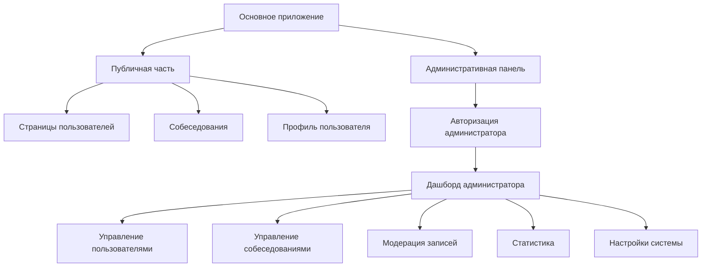
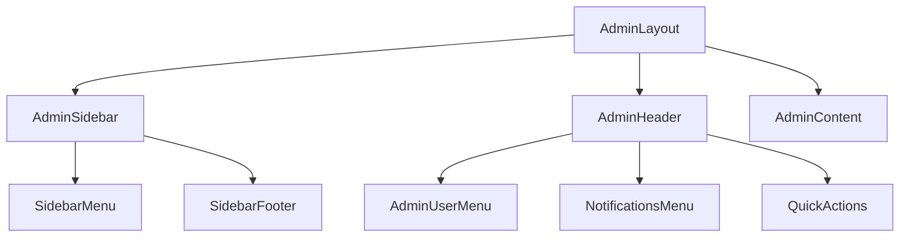
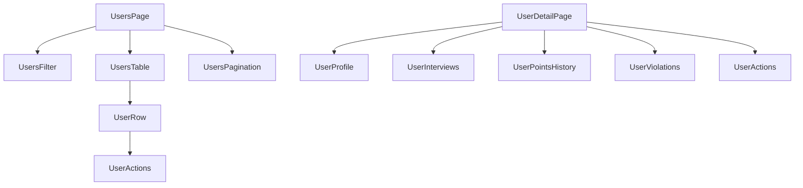
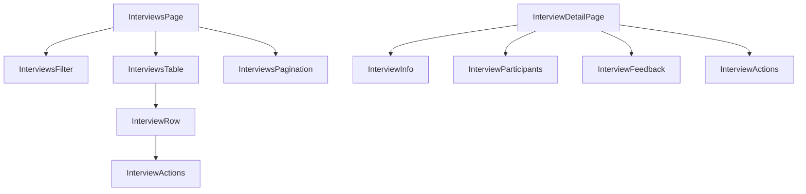
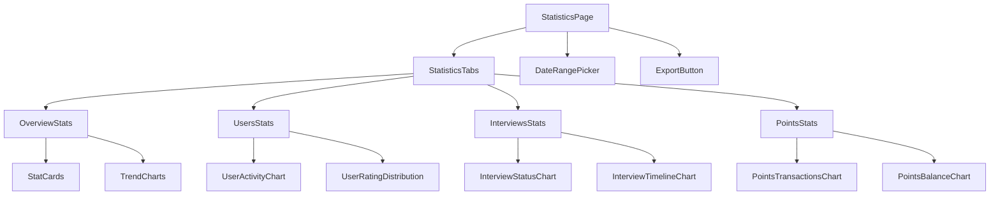

# Архитектура административной панели для системы проведения собеседований

## 1. Общая архитектура

Административная панель будет реализована как отдельный модуль в рамках существующего Next.js приложения. Она будет иметь свою структуру маршрутизации, компоненты и API эндпоинты.



## 2. Изменения в схеме базы данных

### 2.1. Добавление ролей пользователей

Необходимо расширить модель User для поддержки ролей:

```prisma
model User {
  id                   String             @id @default(cuid())
  name                 String?
  email                String?            @unique
  emailVerified        DateTime?
  image                String?
  role                 String             @default("user") // Новое поле: "user" или "admin"
  isBlocked            Boolean            @default(false)  // Новое поле для блокировки пользователей
  accounts             Account[]
  sessions             Session[]
  userProgress         UserProgress[]
  userPoints           UserPoints?
  interviewerSessions  MockInterview[]    @relation("InterviewerRelation")
  intervieweeSessions  MockInterview[]    @relation("IntervieweeRelation")
  violations           UserViolation[]
  pointsTransactions   PointsTransaction[]
  conductedInterviewsCount Int            @default(0)
  lastLoginAt          DateTime?          // Новое поле для отслеживания последнего входа
  createdAt            DateTime           @default(now())
  updatedAt            DateTime           @updatedAt
  adminActions         AdminActionLog[]   // Связь с логами административных действий
}
```

### 2.2. Добавление таблицы для логов административных действий

```prisma
model AdminActionLog {
  id          String   @id @default(cuid())
  adminId     String
  admin       User     @relation(fields: [adminId], references: [id])
  action      String   // Тип действия: "block_user", "edit_interview", "delete_interview", и т.д.
  entityType  String   // Тип сущности: "user", "interview", "feedback", и т.д.
  entityId    String   // ID сущности, над которой выполнено действие
  details     Json?    // Дополнительные детали действия
  createdAt   DateTime @default(now())
}
```

### 2.3. Добавление таблицы для статистики

```prisma
model SystemStatistics {
  id                    String   @id @default(cuid())
  date                  DateTime @unique
  totalUsers            Int      @default(0)
  newUsers              Int      @default(0)
  totalInterviews       Int      @default(0)
  completedInterviews   Int      @default(0)
  cancelledInterviews   Int      @default(0)
  noShowInterviews      Int      @default(0)
  averageTechnicalScore Float    @default(0)
  totalPointsIssued     Int      @default(0)
  totalPointsSpent      Int      @default(0)
}
```

## 3. Структура API эндпоинтов для админ-функций

### 3.1. Аутентификация и авторизация

- `POST /api/admin/login` - Вход для администраторов
- `GET /api/admin/me` - Получение информации о текущем администраторе
- `POST /api/admin/logout` - Выход из административной панели

### 3.2. Управление пользователями

- `GET /api/admin/users` - Получение списка пользователей с пагинацией и фильтрацией
- `GET /api/admin/users/:id` - Получение детальной информации о пользователе
- `PUT /api/admin/users/:id/block` - Блокировка/разблокировка пользователя
- `PUT /api/admin/users/:id/role` - Изменение роли пользователя
- `GET /api/admin/users/:id/interviews` - Получение собеседований пользователя
- `GET /api/admin/users/:id/points-history` - Получение истории баллов пользователя
- `POST /api/admin/users/:id/points` - Начисление/списание баллов пользователю

### 3.3. Управление собеседованиями

- `GET /api/admin/interviews` - Получение списка собеседований с пагинацией и фильтрацией
- `GET /api/admin/interviews/:id` - Получение детальной информации о собеседовании
- `PUT /api/admin/interviews/:id` - Редактирование собеседования
- `DELETE /api/admin/interviews/:id` - Удаление собеседования
- `PUT /api/admin/interviews/:id/status` - Изменение статуса собеседования

### 3.4. Модерация отзывов

- `GET /api/admin/feedbacks` - Получение списка отзывов с пагинацией и фильтрацией
- `PUT /api/admin/feedbacks/:id/approve` - Одобрение отзыва
- `PUT /api/admin/feedbacks/:id/reject` - Отклонение отзыва
- `PUT /api/admin/feedbacks/:id` - Редактирование отзыва
- `DELETE /api/admin/feedbacks/:id` - Удаление отзыва

### 3.5. Статистика

- `GET /api/admin/statistics/overview` - Общая статистика системы
- `GET /api/admin/statistics/users` - Статистика по пользователям
- `GET /api/admin/statistics/interviews` - Статистика по собеседованиям
- `GET /api/admin/statistics/points` - Статистика по баллам
- `GET /api/admin/statistics/export` - Экспорт статистики в CSV/Excel

## 4. Структура страниц и компонентов для фронтенда

### 4.1. Страницы авторизации

- `/admin/login` - Страница входа для администраторов

### 4.2. Основные страницы админ-панели

- `/admin` - Дашборд с общей статистикой и быстрыми действиями
- `/admin/users` - Управление пользователями
- `/admin/users/:id` - Детальная информация о пользователе
- `/admin/interviews` - Управление собеседованиями
- `/admin/interviews/:id` - Детальная информация о собеседовании
- `/admin/feedbacks` - Модерация отзывов
- `/admin/statistics` - Детальная статистика с графиками и фильтрами
- `/admin/settings` - Настройки системы

### 4.3. Компоненты

#### 4.3.1. Компоненты навигации



#### 4.3.2. Компоненты для управления пользователями



#### 4.3.3. Компоненты для управления собеседованиями



#### 4.3.4. Компоненты для статистики



## 5. Дополнительные полезные функции для административной панели

1. **Система уведомлений для администраторов**

   - Уведомления о новых пользователях
   - Уведомления о проблемных собеседованиях (много отмен, низкие оценки)
   - Уведомления о нарушениях пользователей

2. **Массовые действия**

   - Массовая рассылка email-уведомлений пользователям
   - Массовое начисление/списание баллов
   - Массовое изменение статусов собеседований

3. **Система резервного копирования данных**

   - Создание резервных копий базы данных
   - Восстановление данных из резервных копий

4. **Настройка системных параметров**

   - Настройка стоимости бронирования собеседований в баллах
   - Настройка правил начисления баллов
   - Настройка сроков действия нарушений

5. **Журнал аудита действий администраторов**

   - Отслеживание всех действий администраторов
   - Фильтрация и поиск по журналу
   - Экспорт журнала аудита

6. **Управление контентом**

   - Редактирование текстов и уведомлений в системе
   - Управление FAQ и справочной информацией
   - Настройка email-шаблонов

7. **Интеграция с внешними системами**
   - Настройка интеграции с Google Calendar
   - Настройка интеграции с системами аналитики
   - Настройка интеграции с системами оповещений

## 6. Безопасность административной панели

1. **Двухфакторная аутентификация для администраторов**

   - Использование TOTP (Time-based One-Time Password)
   - Возможность использования аппаратных ключей безопасности

2. **Ограничение доступа по IP-адресам**

   - Настройка белого списка IP-адресов
   - Уведомления о попытках входа с неизвестных IP-адресов

3. **Автоматический выход при неактивности**

   - Настраиваемый таймаут сессии
   - Принудительное обновление токена авторизации

4. **Журналирование всех действий администраторов**

   - Детальное логирование всех действий
   - Невозможность удаления или изменения логов

5. **Защита от CSRF, XSS и других типов атак**

   - Использование CSRF-токенов
   - Правильная настройка заголовков безопасности
   - Валидация всех входных данных

6. **Шифрование чувствительных данных**
   - Шифрование данных в базе данных
   - Безопасное хранение ключей и секретов

## 7. Технический стек и реализация

Учитывая, что проект уже использует Next.js и Prisma, мы продолжим использовать эти технологии:

- **Frontend**:

  - Next.js для серверного рендеринга и маршрутизации
  - React для компонентного подхода
  - CSS Modules для стилизации
  - React Query для управления состоянием и кэширования данных

- **Backend**:

  - Next.js API Routes для создания API эндпоинтов
  - Middleware для проверки авторизации и логирования
  - Prisma для работы с базой данных

- **База данных**:

  - PostgreSQL через Prisma ORM
  - Миграции Prisma для управления схемой базы данных

- **Аутентификация**:

  - NextAuth.js с расширением для административной панели
  - JWT для токенов авторизации
  - Bcrypt для хеширования паролей

- **Визуализация данных**:

  - Chart.js или Recharts для графиков и диаграмм
  - React Table для таблиц с сортировкой и фильтрацией

- **UI компоненты**:
  - Material-UI или Chakra UI для базовых компонентов
  - Кастомные компоненты для специфических нужд

## 8. План реализации

### Этап 1: Подготовка и настройка

1. Создание миграции Prisma для добавления новых полей и таблиц
2. Настройка маршрутизации для административной панели
3. Создание базовых компонентов и макетов

### Этап 2: Аутентификация и авторизация

1. Реализация страницы входа для администраторов
2. Настройка NextAuth.js для поддержки ролей
3. Создание middleware для проверки прав доступа

### Этап 3: Основные функции управления

1. Реализация управления пользователями
2. Реализация управления собеседованиями
3. Реализация модерации отзывов

### Этап 4: Статистика и аналитика

1. Сбор и агрегация данных для статистики
2. Реализация визуализации данных
3. Создание системы экспорта данных

### Этап 5: Дополнительные функции

1. Реализация системы уведомлений
2. Настройка массовых действий
3. Создание журнала аудита

### Этап 6: Безопасность и оптимизация

1. Внедрение мер безопасности
2. Оптимизация производительности
3. Тестирование и отладка

## 9. Заключение

Предложенная архитектура административной панели обеспечивает полный контроль над системой проведения собеседований, предоставляя администраторам все необходимые инструменты для управления пользователями, собеседованиями, отзывами и статистикой. Модульный подход позволяет легко расширять функциональность в будущем, а внимание к безопасности гарантирует защиту чувствительных данных.
