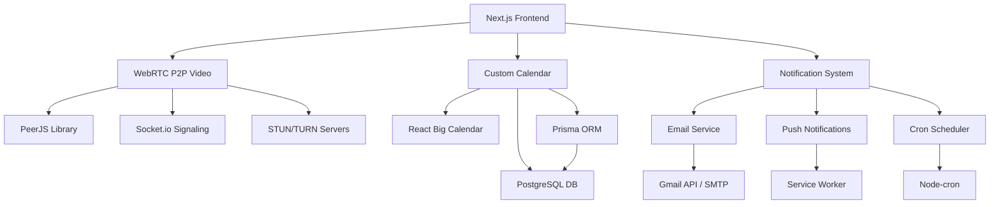

# План интеграции собственного решения: видеочат, календарь и уведомления

## 📋 Обзор проекта

Данный план описывает поэтапную интеграцию собственного решения для замены зависимости от Google Meet на независимую систему, включающую:

- **P2P видеочат** на базе WebRTC
- **Собственный календарь** с управлением событиями
- **Система уведомлений** (email + push)

## 🎯 Цели проекта

1. **Независимость** от внешних сервисов (Google Meet, Google Calendar)
2. **Полный контроль** над функциональностью
3. **Кастомизация** под специфические потребности
4. **Приватность** и безопасность данных
5. **Отсутствие лимитов** внешних API

## 🏗️ Архитектура решения



## 📦 Технологический стек

### Frontend

- **React Big Calendar** - компонент календаря
- **PeerJS** - P2P видеосвязь
- **Socket.io-client** - real-time коммуникация
- **React Hot Toast** - уведомления в UI

### Backend

- **Socket.io** - signaling сервер для WebRTC
- **Node-cron** - планировщик задач
- **Web-push** - браузерные push уведомления
- **Nodemailer** - email уведомления

### Инфраструктура

- **STUN/TURN серверы** - для NAT traversal
- **Service Worker** - для push уведомлений
- **PostgreSQL** - хранение событий календаря

## 🚀 Этапы реализации

### Этап 1: Подготовка инфраструктуры (1-2 недели)

#### 1.1 Установка зависимостей

```bash
# Видеочат
npm install peerjs socket.io socket.io-client

# Календарь
npm install react-big-calendar moment

# Уведомления
npm install react-hot-toast node-cron web-push

# Дополнительные утилиты
npm install uuid
```

#### 1.2 Обновление схемы базы данных

```prisma
// prisma/schema.prisma

model CalendarEvent {
  id          String   @id @default(cuid())
  title       String
  description String?
  startTime   DateTime
  endTime     DateTime
  userId      String
  attendees   Json     // Массив участников
  meetingLink String?  // Ссылка на P2P комнату
  roomId      String?  // ID комнаты для видеочата
  status      EventStatus @default(SCHEDULED)
  createdAt   DateTime @default(now())
  updatedAt   DateTime @updatedAt

  user        User     @relation(fields: [userId], references: [id])

  @@map("calendar_events")
}

model NotificationSubscription {
  id       String @id @default(cuid())
  userId   String
  endpoint String
  keys     Json   // Push subscription keys

  user     User   @relation(fields: [userId], references: [id])

  @@map("notification_subscriptions")
}

enum EventStatus {
  SCHEDULED
  IN_PROGRESS
  COMPLETED
  CANCELLED
}
```

#### 1.3 Настройка STUN/TURN серверов

```javascript
// lib/webrtc/config.js
export const webrtcConfig = {
  iceServers: [
    { urls: 'stun:stun.l.google.com:19302' },
    { urls: 'stun:stun1.l.google.com:19302' },
    // Для продакшена добавить собственный TURN сервер
    // {
    //   urls: 'turn:your-turn-server.com:3478',
    //   username: 'user',
    //   credential: 'pass'
    // }
  ],
};
```

### Этап 2: Реализация P2P видеочата (2-3 недели)

#### 2.1 Создание signaling сервера

```javascript
// server/signaling.js
const { Server } = require('socket.io');

class SignalingServer {
  constructor(httpServer) {
    this.io = new Server(httpServer, {
      cors: { origin: '*' },
    });

    this.rooms = new Map();
    this.setupEventHandlers();
  }

  setupEventHandlers() {
    this.io.on('connection', (socket) => {
      console.log('User connected:', socket.id);

      socket.on('join-room', (roomId, userId) => {
        this.joinRoom(socket, roomId, userId);
      });

      socket.on('offer', (offer, roomId) => {
        socket.to(roomId).emit('offer', offer, socket.id);
      });

      socket.on('answer', (answer, roomId) => {
        socket.to(roomId).emit('answer', answer, socket.id);
      });

      socket.on('ice-candidate', (candidate, roomId) => {
        socket.to(roomId).emit('ice-candidate', candidate, socket.id);
      });

      socket.on('disconnect', () => {
        this.handleDisconnect(socket);
      });
    });
  }
}
```

#### 2.2 Компонент видеочата

```javascript
// components/VideoChat/VideoChat.js
import { useEffect, useRef, useState } from 'react';
import Peer from 'peerjs';
import io from 'socket.io-client';

export default function VideoChat({ roomId, userId, onLeave }) {
  const [peer, setPeer] = useState(null);
  const [socket, setSocket] = useState(null);
  const [localStream, setLocalStream] = useState(null);
  const [remoteStreams, setRemoteStreams] = useState(new Map());
  const [isVideoEnabled, setIsVideoEnabled] = useState(true);
  const [isAudioEnabled, setIsAudioEnabled] = useState(true);

  const localVideoRef = useRef();
  const remoteVideosRef = useRef(new Map());

  useEffect(() => {
    initializeVideoChat();
    return () => cleanup();
  }, [roomId]);

  const initializeVideoChat = async () => {
    try {
      // Получаем медиа поток
      const stream = await navigator.mediaDevices.getUserMedia({
        video: true,
        audio: true,
      });

      setLocalStream(stream);
      if (localVideoRef.current) {
        localVideoRef.current.srcObject = stream;
      }

      // Создаем peer соединение
      const newPeer = new Peer(userId, {
        config: webrtcConfig,
      });

      setPeer(newPeer);

      // Подключаемся к signaling серверу
      const newSocket = io(process.env.NEXT_PUBLIC_SIGNALING_SERVER);
      setSocket(newSocket);

      // Присоединяемся к комнате
      newSocket.emit('join-room', roomId, userId);

      // Обработчики событий
      setupPeerEvents(newPeer, stream);
      setupSocketEvents(newSocket, newPeer, stream);
    } catch (error) {
      console.error('Ошибка инициализации видеочата:', error);
    }
  };

  return (
    <div className="video-chat">
      <div className="video-grid">
        {/* Локальное видео */}
        <div className="video-container local">
          <video
            ref={localVideoRef}
            autoPlay
            muted
            playsInline
            className={`video ${!isVideoEnabled ? 'video-disabled' : ''}`}
          />
          <div className="video-label">Вы</div>
        </div>

        {/* Удаленные видео */}
        {Array.from(remoteStreams.entries()).map(([userId, stream]) => (
          <div key={userId} className="video-container remote">
            <video
              ref={(el) => {
                if (el) {
                  remoteVideosRef.current.set(userId, el);
                  el.srcObject = stream;
                }
              }}
              autoPlay
              playsInline
              className="video"
            />
            <div className="video-label">{userId}</div>
          </div>
        ))}
      </div>

      {/* Панель управления */}
      <div className="controls">
        <button
          onClick={toggleVideo}
          className={`control-btn ${!isVideoEnabled ? 'disabled' : ''}`}
        >
          {isVideoEnabled ? '📹' : '📹❌'}
        </button>

        <button
          onClick={toggleAudio}
          className={`control-btn ${!isAudioEnabled ? 'disabled' : ''}`}
        >
          {isAudioEnabled ? '🎤' : '🎤❌'}
        </button>

        <button onClick={onLeave} className="control-btn leave">
          📞❌
        </button>
      </div>
    </div>
  );
}
```

### Этап 3: Реализация календаря (2 недели)

#### 3.1 Компонент календаря

```javascript
// components/Calendar/CustomCalendar.js
import { Calendar, momentLocalizer } from 'react-big-calendar';
import moment from 'moment';
import 'moment/locale/ru';

moment.locale('ru');
const localizer = momentLocalizer(moment);

export default function CustomCalendar({
  userId,
  onEventSelect,
  onSlotSelect,
}) {
  const [events, setEvents] = useState([]);
  const [loading, setLoading] = useState(true);

  useEffect(() => {
    loadEvents();
  }, [userId]);

  const loadEvents = async () => {
    try {
      const response = await fetch(`/api/calendar/events?userId=${userId}`);
      const data = await response.json();

      const formattedEvents = data.map((event) => ({
        id: event.id,
        title: event.title,
        start: new Date(event.startTime),
        end: new Date(event.endTime),
        resource: event,
      }));

      setEvents(formattedEvents);
    } catch (error) {
      console.error('Ошибка загрузки событий:', error);
    } finally {
      setLoading(false);
    }
  };

  return (
    <div className="custom-calendar">
      <Calendar
        localizer={localizer}
        events={events}
        startAccessor="start"
        endAccessor="end"
        onSelectEvent={handleSelectEvent}
        onSelectSlot={handleSelectSlot}
        selectable
        popup
        eventPropGetter={eventStyleGetter}
        views={['month', 'week', 'day']}
        defaultView="week"
        messages={{
          next: 'Далее',
          previous: 'Назад',
          today: 'Сегодня',
          month: 'Месяц',
          week: 'Неделя',
          day: 'День',
        }}
        style={{ height: 600 }}
      />
    </div>
  );
}
```

### Этап 4: Система уведомлений (1-2 недели)

#### 4.1 Email уведомления

```javascript
// lib/notifications/emailTemplates.js
export const emailTemplates = {
  eventCreated: (event, recipient) => ({
    subject: `Приглашение на встречу: ${event.title}`,
    html: `
      <div style="font-family: Arial, sans-serif; max-width: 600px; margin: 0 auto;">
        <h2>Приглашение на встречу</h2>
        <p>Здравствуйте!</p>
        <p>Вы приглашены на встречу <strong>${event.title}</strong></p>
        
        <div style="background: #f5f5f5; padding: 15px; border-radius: 5px; margin: 20px 0;">
          <p><strong>Дата:</strong> ${new Date(
            event.startTime
          ).toLocaleDateString('ru-RU')}</p>
          <p><strong>Время:</strong> ${new Date(
            event.startTime
          ).toLocaleTimeString('ru-RU', {
            hour: '2-digit',
            minute: '2-digit',
          })}</p>
        </div>
        
        <p>
          <a href="${event.meetingLink}" 
             style="background: #007bff; color: white; padding: 10px 20px; text-decoration: none; border-radius: 5px;">
            Присоединиться к встрече
          </a>
        </p>
      </div>
    `,
  }),
};
```

#### 4.2 Push уведомления

```javascript
// lib/notifications/pushNotifications.js
import webpush from 'web-push';

webpush.setVapidDetails(
  'mailto:your-email@example.com',
  process.env.VAPID_PUBLIC_KEY,
  process.env.VAPID_PRIVATE_KEY
);

export async function sendPushNotification(subscription, payload) {
  try {
    await webpush.sendNotification(subscription, JSON.stringify(payload));
    console.log('Push уведомление отправлено');
  } catch (error) {
    console.error('Ошибка отправки push уведомления:', error);
  }
}
```

### Этап 5: Интеграция и тестирование (1 неделя)

#### 5.1 Обновление существующих компонентов

- Замена Google Meet ссылок на собственные комнаты
- Интеграция календаря в существующий интерфейс
- Настройка уведомлений

#### 5.2 Тестирование

- Функциональное тестирование видеочата
- Проверка синхронизации календаря
- Тестирование доставки уведомлений

## 📋 Чек-лист реализации

### Этап 1: Инфраструктура

- [ ] Установить зависимости
- [ ] Обновить схему БД
- [ ] Настроить STUN/TURN серверы
- [ ] Создать миграции Prisma

### Этап 2: Видеочат

- [ ] Реализовать signaling сервер
- [ ] Создать компонент видеочата
- [ ] Добавить управление медиа
- [ ] Протестировать P2P соединения

### Этап 3: Календарь

- [ ] Интегрировать React Big Calendar
- [ ] Создать API для событий
- [ ] Добавить CRUD операции
- [ ] Настроить локализацию

### Этап 4: Уведомления

- [ ] Настроить email шаблоны
- [ ] Реализовать планировщик
- [ ] Добавить push уведомления
- [ ] Создать Service Worker

### Этап 5: Интеграция

- [ ] Обновить существующие страницы
- [ ] Провести тестирование
- [ ] Оптимизировать производительность
- [ ] Подготовить документацию

## 🔧 Конфигурация окружения

### Переменные окружения

```env
# WebRTC
NEXT_PUBLIC_SIGNALING_SERVER=http://localhost:3001

# Push уведомления
VAPID_PUBLIC_KEY=your_vapid_public_key
VAPID_PRIVATE_KEY=your_vapid_private_key

# TURN сервер (опционально)
TURN_SERVER_URL=turn:your-turn-server.com:3478
TURN_USERNAME=username
TURN_PASSWORD=password
```

## 📊 Метрики успеха

1. **Функциональность**: 100% замещение Google Meet
2. **Производительность**: Время подключения < 5 сек
3. **Надежность**: Uptime > 99%
4. **Пользовательский опыт**: Интуитивный интерфейс
5. **Масштабируемость**: Поддержка до 100 одновременных комнат

## 🚨 Риски и митигация

### Технические риски

- **NAT traversal проблемы** → Настройка TURN сервера
- **Производительность WebRTC** → Оптимизация кодеков
- **Совместимость браузеров** → Полифиллы и fallback

### Операционные риски

- **Нагрузка на сервер** → Горизонтальное масштабирование
- **Отказ уведомлений** → Резервные каналы
- **Потеря данных** → Регулярные бэкапы

## 📚 Дополнительные ресурсы

- [WebRTC документация](https://webrtc.org/)
- [PeerJS руководство](https://peerjs.com/docs/)
- [React Big Calendar](https://github.com/jquense/react-big-calendar)
- [Web Push Protocol](https://tools.ietf.org/html/rfc8030)

## 🎯 Следующие шаги

1. Утверждение архитектуры
2. Настройка среды разработки
3. Начало реализации Этапа 1
4. Еженедельные ретроспективы
5. Подготовка к продакшен деплою
