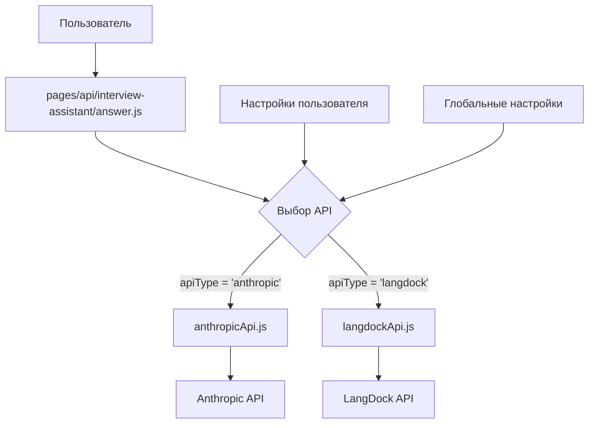
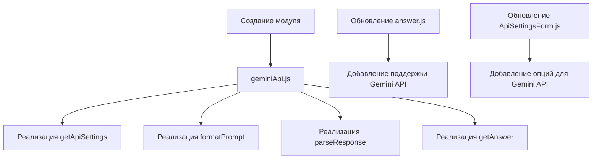
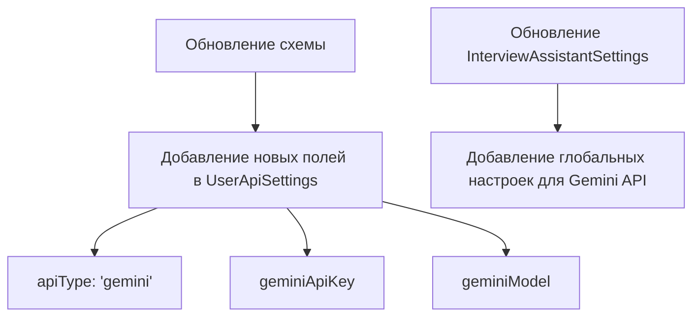

# Анализ бесплатных API для чата с ИИ как альтернативы LangDock

## Текущая ситуация

### Архитектура интеграции с API для чата с ИИ

### Ключевые требования к API для чата с ИИ

1. **Функциональные требования:**

   - Отправка вопросов и получение ответов
   - Поддержка контекста (компания, дата собеседования)
   - Форматирование ответов с использованием markdown
   - Логирование использования (токены, стоимость)
   - Кэширование ответов

2. **Нефункциональные требования:**
   - Простота интеграции и настройки
   - Наличие бесплатного тарифа
   - Минимальные технические требования для пользователей
   - Стабильность API

### Проблемы с LangDock

1. **Сложный процесс настройки:**

   - Регистрация на платформе
   - Создание и настройка ассистента
   - Получение ID ассистента
   - Настройка переменных окружения

2. **Технические сложности:**
   - Необходимость понимания работы с API
   - Множество шагов для настройки
   - Потенциальные проблемы с совместимостью моделей

## Сравнительная таблица API для чата с ИИ

| API           | Бесплатный тариф        | Простота настройки | Качество моделей      | Поддержка русского    | Стабильность               | Документация          |
| ------------- | ----------------------- | ------------------ | --------------------- | --------------------- | -------------------------- | --------------------- |
| OpenAI API    | ⭐⭐ (Временно)         | ⭐⭐⭐⭐ (Простая) | ⭐⭐⭐⭐⭐ (Отличное) | ⭐⭐⭐⭐⭐ (Отличная) | ⭐⭐⭐⭐ (Высокая)         | ⭐⭐⭐⭐⭐ (Отличная) |
| Anthropic API | ⭐⭐ (Временно)         | ⭐⭐⭐ (Средняя)   | ⭐⭐⭐⭐⭐ (Отличное) | ⭐⭐⭐⭐ (Хорошая)    | ⭐⭐⭐⭐ (Высокая)         | ⭐⭐⭐⭐ (Хорошая)    |
| Google Gemini | ⭐⭐⭐⭐⭐ (Постоянный) | ⭐⭐⭐ (Средняя)   | ⭐⭐⭐⭐ (Хорошее)    | ⭐⭐⭐⭐ (Хорошая)    | ⭐⭐⭐⭐⭐ (Очень высокая) | ⭐⭐⭐⭐⭐ (Отличная) |
| Cohere API    | ⭐⭐⭐ (Ограниченный)   | ⭐⭐⭐⭐ (Простая) | ⭐⭐⭐⭐ (Хорошее)    | ⭐⭐⭐ (Средняя)      | ⭐⭐⭐⭐ (Высокая)         | ⭐⭐⭐⭐ (Хорошая)    |
| Mistral AI    | ⭐⭐⭐⭐ (Постоянный)   | ⭐⭐⭐⭐ (Простая) | ⭐⭐⭐⭐ (Хорошее)    | ⭐⭐⭐ (Средняя)      | ⭐⭐⭐⭐ (Высокая)         | ⭐⭐⭐ (Хорошая)      |
| Ollama        | ⭐⭐⭐⭐⭐ (Полностью)  | ⭐⭐ (Сложная)     | ⭐⭐⭐ (Среднее)      | ⭐⭐⭐ (Средняя)      | ⭐⭐⭐ (Средняя)           | ⭐⭐⭐ (Хорошая)      |
| Hugging Face  | ⭐⭐⭐⭐ (Постоянный)   | ⭐⭐⭐ (Средняя)   | ⭐⭐⭐⭐ (Хорошее)    | ⭐⭐⭐⭐ (Хорошая)    | ⭐⭐⭐ (Средняя)           | ⭐⭐⭐⭐ (Хорошая)    |

## Детальное сравнение

### 1. Google Gemini API

- **Бесплатный тариф**: Постоянный с щедрыми лимитами (до 2 млн символов в день)
- **Настройка**: Получение API ключа через Google AI Studio
- **Качество**: Gemini 1.5 Pro сравнимо с ведущими моделями
- **Русский язык**: Хорошая поддержка
- **Преимущества**: Высокая стабильность, отличная документация, простая интеграция
- **Недостатки**: Интеграция через Google Cloud может быть немного сложнее

### 2. Mistral AI

- **Бесплатный тариф**: Постоянный (5 запросов/мин, 200 запросов/день)
- **Настройка**: API совместим с OpenAI, что упрощает миграцию
- **Качество**: Хорошее для большинства задач
- **Русский язык**: Средняя поддержка
- **Преимущества**: Простая интеграция, совместимость с OpenAI API
- **Недостатки**: Ограниченная поддержка русского языка

### 3. OpenAI API

- **Бесплатный тариф**: Временные $5 кредитов для новых пользователей (действуют 3 месяца)
- **Настройка**: Очень простая - требуется только регистрация и получение API ключа
- **Качество**: Отличное, особенно GPT-4o
- **Русский язык**: Отличная поддержка
- **Преимущества**: Высокое качество ответов, простая интеграция
- **Недостатки**: Временный бесплатный тариф, после которого требуется оплата

## Рекомендация

**Google Gemini API** является наиболее подходящей альтернативой LangDock для приложения-ассистента для интервью по следующим причинам:

1. Постоянный бесплатный тариф с щедрыми лимитами
2. Высокое качество моделей для технических ответов
3. Хорошая поддержка русского языка
4. Очень высокая стабильность и надежность
5. Отличная документация и поддержка
6. Простая интеграция в существующую архитектуру

## План интеграции Google Gemini API

### Этап 1: Подготовка и настройка

1. **Изучение документации Gemini API:**

   - Ознакомление с процессом регистрации и получения API ключа
   - Изучение доступных моделей и их возможностей
   - Анализ ограничений бесплатного уровня

2. **Регистрация и получение API ключа:**
   - Создание проекта в Google AI Studio
   - Получение API ключа для Gemini API
   - Документирование процесса для пользователей

### Этап 2: Разработка модуля интеграции

#### Шаги разработки:

1. **Создание модуля для Gemini API:**

   - Создать файл `lib/utils/geminiApi.js`
   - Реализовать основные функции по аналогии с существующими модулями:
     - `getApiSettings` - получение настроек API
     - `formatPrompt` - форматирование запроса для Gemini API
     - `parseResponse` - обработка ответа от API
     - `getAnswer` - основная функция для получения ответа

2. **Обновление API эндпоинта:**

   - Модифицировать `pages/api/interview-assistant/answer.js` для поддержки Gemini API
   - Добавить условие для выбора Gemini API (`apiType === 'gemini'`)

3. **Обновление формы настроек:**
   - Добавить опцию выбора Gemini API в `components/user/ApiSettingsForm.js`
   - Добавить поля для настройки Gemini API (API ключ, модель)

### Этап 3: Обновление схемы базы данных

#### Необходимые изменения:

1. **Обновление таблицы `UserApiSettings`:**

   - Добавление полей для хранения ключа и настроек Gemini API
   - Обновление типа `apiType` для поддержки значения 'gemini'

2. **Обновление таблицы `InterviewAssistantSettings`:**
   - Добавление полей для глобальных настроек Gemini API

### Этап 4: Тестирование и оптимизация

1. **Тестирование функциональности:**

   - Проверка работы с Gemini API
   - Сравнение качества и скорости ответов
   - Проверка корректности логирования и кэширования

2. **Оптимизация промптов:**
   - Адаптация системных промптов для Gemini API
   - Настройка параметров для улучшения качества ответов

### Этап 5: Документация и внедрение

1. **Создание руководства по настройке:**

   - Пошаговая инструкция по получению API ключа Gemini
   - Рекомендации по настройке параметров
   - Примеры использования

2. **Обновление пользовательского интерфейса:**
   - Добавление подсказок и инструкций в интерфейс
   - Упрощение процесса настройки
   - Добавление информации о преимуществах Gemini API

## Сохранение поддержки существующих API

Для обеспечения плавного перехода и удовлетворения потребностей всех пользователей, рекомендуется сохранить поддержку существующих API:

1. **Anthropic API** - как основной API, используемый по умолчанию
2. **LangDock API** - как опция для пользователей, которые уже его настроили
3. **Gemini API** - как новая, более простая альтернатива

Это позволит пользователям выбрать наиболее подходящий для них вариант в зависимости от их потребностей и технических возможностей.
