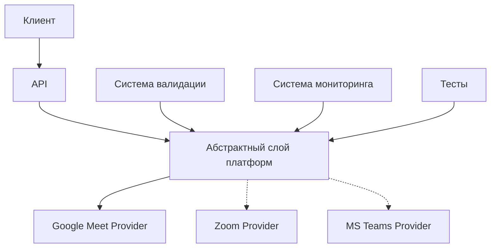
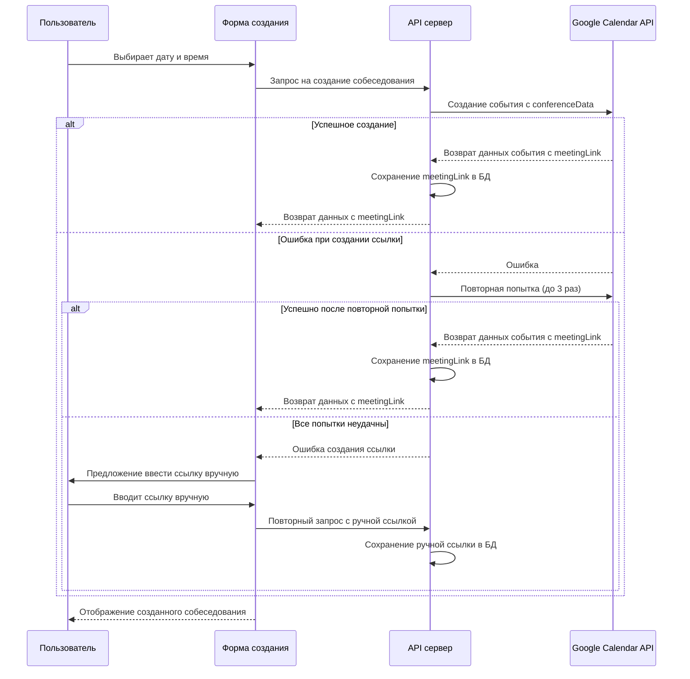
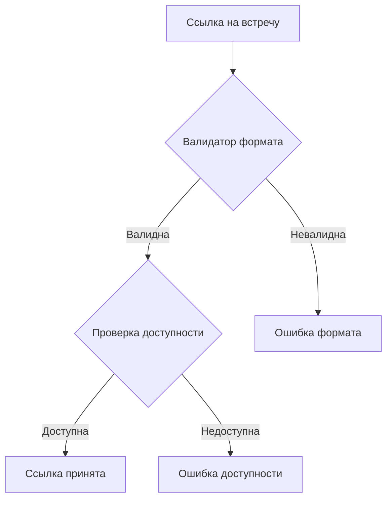
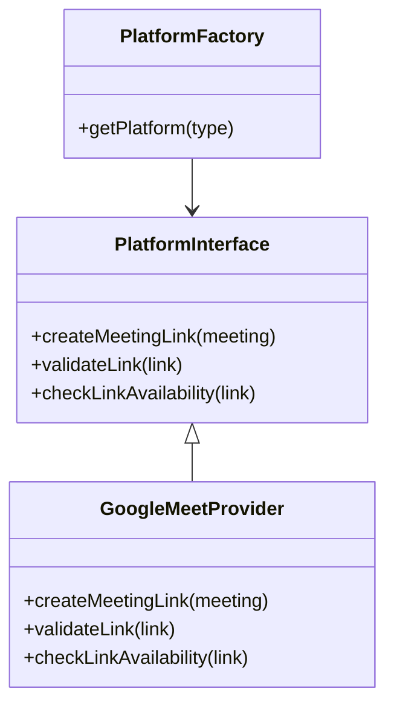
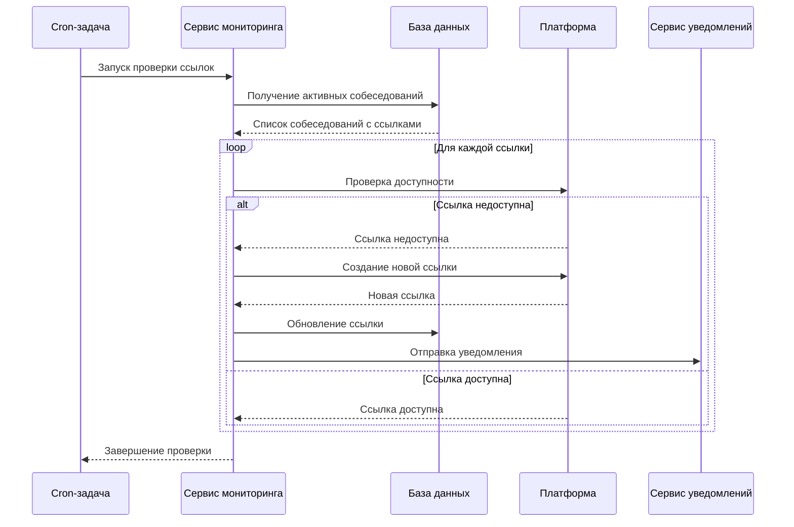
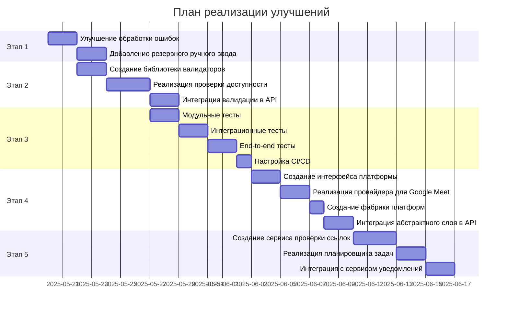

# План улучшений автоматизации Google Meet для собеседований

## Введение

Данный документ содержит план улучшений для текущей реализации автоматизации Google Meet в системе проведения собеседований. План основан на анализе текущего кода и выявленных слабых сторонах существующей реализации.

## Текущее состояние

На данный момент в проекте уже реализовано:

- Базовая автоматизация создания ссылок на Google Meet через Google Calendar API
- Минимальная валидация ссылок (проверка наличия "meet.google.com")
- Ручное тестирование через скрипт `test-meet-automation.sh`

Отсутствуют:

- Абстрактный слой для поддержки разных платформ
- Полноценная система валидации и проверки доступности ссылок
- Автоматические тесты
- Система мониторинга и восстановления ссылок

## Основные предложения по улучшению

### 1. Мультиплатформенная архитектура

- Создание абстрактного слоя для поддержки разных платформ (Google Meet, Zoom, Microsoft Teams)
- Реализация специализированных провайдеров для каждой платформы
- Изменение схемы базы данных для хранения информации о платформе

### 2. Улучшение автоматизации создания ссылок

- Добавление механизма повторных попыток при сбоях
- Реализация резервного ручного ввода ссылок
- Улучшение обработки ошибок

### 3. Расширенная система валидации ссылок

- Создание библиотеки валидаторов для разных форматов ссылок
- Реализация проверки доступности ссылок
- Интеграция валидации в API-эндпоинты

### 4. Комплексная система тестирования

- Модульные тесты для сервисов платформ
- Интеграционные тесты для API-эндпоинтов
- End-to-end тесты с использованием Cypress
- Настройка CI/CD для автоматического запуска тестов

### 5. Система мониторинга и восстановления ссылок

- Создание сервиса для периодической проверки ссылок
- Реализация планировщика задач
- Автоматическое восстановление недействительных ссылок
- Интеграция с системой уведомлений

## Общая архитектура решения



## Детальный план реализации

### Этап 1: Улучшение автоматизации создания ссылок (Неделя 1)

#### Задача 1.1: Улучшение обработки ошибок

- **Сложность:** Средняя
- **Описание:** Добавление механизма повторных попыток и улучшенной обработки ошибок при создании ссылок
- **Файлы для изменения:**
  - `lib/utils/googleCalendar.js`

#### Задача 1.2: Добавление резервного ручного ввода

- **Сложность:** Средняя
- **Описание:** Добавление опции ручного ввода ссылки в случае сбоя автоматизации
- **Файлы для изменения:**
  - `pages/mock-interviews/new.js`
  - `pages/api/mock-interviews/index.js`



### Этап 2: Система валидации и проверки доступности ссылок (Неделя 1-2)

#### Задача 2.1: Создание библиотеки валидаторов

- **Сложность:** Средняя
- **Описание:** Разработка библиотеки для валидации ссылок на видеоконференции
- **Файлы для создания:**
  - `lib/validators/meetingLinks.js`

#### Задача 2.2: Реализация проверки доступности ссылок

- **Сложность:** Высокая
- **Описание:** Создание функционала для проверки доступности ссылок
- **Файлы для создания:**
  - `lib/validators/linkChecker.js`

#### Задача 2.3: Интеграция валидации в API-эндпоинты

- **Сложность:** Средняя
- **Описание:** Добавление валидации в API-эндпоинты создания и бронирования собеседований
- **Файлы для изменения:**
  - `pages/api/mock-interviews/index.js`
  - `pages/api/mock-interviews/[id]/book.js`



### Этап 3: Комплексная система тестирования (Неделя 2)

#### Задача 3.1: Модульные тесты для сервисов

- **Сложность:** Средняя
- **Описание:** Создание модульных тестов для сервисов работы с Google Meet
- **Файлы для создания:**
  - `__tests__/lib/utils/googleCalendar.test.js`
  - `__tests__/lib/validators/meetingLinks.test.js`

#### Задача 3.2: Интеграционные тесты для API

- **Сложность:** Высокая
- **Описание:** Разработка интеграционных тестов для API-эндпоинтов
- **Файлы для создания:**
  - `__tests__/api/mock-interviews/index.test.js`
  - `__tests__/api/mock-interviews/book.test.js`

#### Задача 3.3: End-to-end тесты с Cypress

- **Сложность:** Высокая
- **Описание:** Создание E2E тестов для проверки полного процесса создания и бронирования собеседований
- **Файлы для создания:**
  - `cypress/integration/create-interview.spec.js`
  - `cypress/integration/book-interview.spec.js`

#### Задача 3.4: Настройка CI/CD для запуска тестов

- **Сложность:** Средняя
- **Описание:** Настройка GitHub Actions для автоматического запуска тестов
- **Файлы для создания:**
  - `.github/workflows/test.yml`

### Этап 4: Абстрактный слой для мультиплатформенной архитектуры (Неделя 3)

#### Задача 4.1: Создание интерфейса платформы

- **Сложность:** Средняя
- **Описание:** Разработка абстрактного интерфейса для работы с платформами видеоконференций
- **Файлы для создания:**
  - `lib/platforms/PlatformInterface.js`

#### Задача 4.2: Реализация провайдера для Google Meet

- **Сложность:** Средняя
- **Описание:** Реализация провайдера для Google Meet на основе абстрактного интерфейса
- **Файлы для создания:**
  - `lib/platforms/GoogleMeetProvider.js`

#### Задача 4.3: Создание фабрики платформ

- **Сложность:** Низкая
- **Описание:** Разработка фабрики для создания экземпляров платформ
- **Файлы для создания:**
  - `lib/platforms/PlatformFactory.js`

#### Задача 4.4: Интеграция абстрактного слоя в API

- **Сложность:** Средняя
- **Описание:** Обновление API-эндпоинтов для использования абстрактного слоя
- **Файлы для изменения:**
  - `pages/api/mock-interviews/index.js`
  - `pages/api/mock-interviews/[id]/book.js`



### Этап 5: Система мониторинга и восстановления ссылок (Неделя 4)

#### Задача 5.1: Создание сервиса проверки ссылок

- **Сложность:** Высокая
- **Описание:** Разработка сервиса для периодической проверки валидности ссылок
- **Файлы для создания:**
  - `lib/services/LinkMonitoringService.js`

#### Задача 5.2: Реализация планировщика задач

- **Сложность:** Средняя
- **Описание:** Настройка cron-задач в Next.js для периодического запуска проверок
- **Файлы для создания:**
  - `pages/api/cron/check-links.js`

#### Задача 5.3: Интеграция с сервисом уведомлений

- **Сложность:** Низкая
- **Описание:** Интеграция системы мониторинга с существующим сервисом уведомлений
- **Файлы для изменения:**
  - `contexts/NotificationContext.js`
  - `components/Notification.js`



## Изменения в схеме базы данных

Для поддержки мультиплатформенной архитектуры потребуется внести следующие изменения в модель `MockInterview`:

```prisma
model MockInterview {
  // Существующие поля...
  meetingLink        String
  meetingPlatform    String  @default("google_meet") // Тип платформы
  platformData       Json?   // Дополнительные данные платформы
  // Остальные поля...
}
```

## Зависимости между задачами и сроки



## Технические требования

1. **Библиотеки и API**:

   - Google Calendar API (уже используется)
   - Jest для модульных и интеграционных тестов
   - Cypress для E2E тестов
   - node-cron для планировщика задач

2. **Инструменты**:
   - GitHub Actions для CI/CD
   - Postman для тестирования API

## Потенциальные риски и их минимизация

| Риск                               | Вероятность | Влияние | Стратегия минимизации                                             |
| ---------------------------------- | ----------- | ------- | ----------------------------------------------------------------- |
| Изменения в Google Calendar API    | Низкая      | Высокое | Мониторинг изменений API, абстрактный слой для изоляции изменений |
| Проблемы с доступностью Google API | Средняя     | Высокое | Механизм повторных попыток, резервный ручной ввод                 |
| Сложности с валидацией ссылок      | Средняя     | Среднее | Тщательное тестирование, постепенное внедрение                    |
| Задержки в реализации              | Средняя     | Среднее | Четкая приоритизация задач, буфер времени в плане                 |

## Рекомендации по дальнейшим действиям

1. Начать с реализации первого этапа (улучшение автоматизации создания ссылок), так как это даст быстрые результаты и повысит надежность системы
2. Параллельно разработать систему валидации ссылок
3. Внедрить тесты для обеспечения качества кода
4. Постепенно реализовать мультиплатформенную архитектуру
5. В завершение добавить систему мониторинга и восстановления ссылок

Этот план позволит поэтапно улучшить автоматизацию Google Meet для собеседований, сделав систему более надежной, гибкой и удобной для пользователей.
