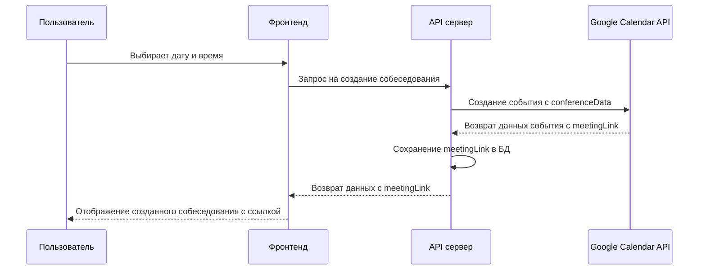

# План автоматизации создания ссылок на Google Meet

## Текущая логика

- Пользователь сам создает ссылку на Google Meet и вставляет её в форму
- Ссылка сохраняется в базе данных в поле `meetingLink` модели `MockInterview`
- При создании события в календаре эта ссылка добавляется в описание события

## 1. Автоматизация через Google Calendar API

**Да, можно автоматизировать создание ссылки через Google Calendar API.**

В проекте уже есть необходимая инфраструктура для этого:

- В файле `lib/utils/googleCalendar.js` реализована функция `createCalendarEvent`, которая создает событие в Google Calendar с автоматическим созданием ссылки на Google Meet через параметр `conferenceData`.
- Уже используется OAuth2 аутентификация для Google API с автоматическим обновлением токенов.

### Предлагаемая автоматизация:



### Необходимые изменения:

1. **Изменение процесса создания собеседования**:

   - Удалить шаг 2 (ручное создание ссылки) из `pages/mock-interviews/new.js`
   - Изменить API-эндпоинт `pages/api/mock-interviews/index.js` для автоматического создания ссылки

2. **Расширение функциональности `createCalendarEvent`**:
   - Модифицировать функцию для возврата ссылки на Google Meet из созданного события
   - Использовать эту ссылку при создании записи в базе данных

## 2. Проверка валидности ссылки

**Да, проверка валидности ссылки необходима, но при автоматизации она становится менее критичной.**

### Текущая реализация:

В файле `pages/mock-interviews/new.js` уже есть простая проверка:

```javascript
const isValidMeetingLink = (link) => {
  // Простая проверка на наличие meet.google.com в ссылке
  return link.includes('meet.google.com');
};
```

Аналогичная проверка есть в API-эндпоинте `pages/api/mock-interviews/index.js`.

### Рекомендации:

1. **При автоматизации**:

   - Проверка не требуется, так как ссылка создается напрямую через Google API
   - Можно добавить проверку успешности создания ссылки

2. **При сохранении ручного ввода**:
   - Улучшить валидацию с помощью регулярных выражений
   - Добавить проверку доступности ссылки (опционально)

## 3. Альтернативные платформы

**Да, стоит добавить поддержку альтернативных платформ.**

### Преимущества добавления альтернативных платформ:

1. **Гибкость для пользователей** - разные пользователи могут предпочитать разные платформы
2. **Отказоустойчивость** - если одна платформа недоступна, можно использовать другую
3. **Расширение функциональности** - некоторые платформы могут предлагать уникальные возможности

### Варианты реализации:

1. **Ручной выбор платформы**:

   ```mermaid
   graph TD
       A[Выбор платформы] --> B{Какая платформа?}
       B -->|Google Meet| C[Создание через Google API]
       B -->|Zoom| D[Создание через Zoom API]
       B -->|Microsoft Teams| E[Создание через Microsoft API]
       B -->|Ручной ввод| F[Ввод ссылки вручную]
   ```

2. **Автоматическое создание для всех поддерживаемых платформ**:
   - Создание ссылок для всех платформ
   - Сохранение их в базе данных
   - Предоставление пользователю выбора, какую использовать

### Технические аспекты:

1. **Google Meet**:

   - Уже реализовано через Google Calendar API
   - Требует OAuth2 аутентификацию (уже настроено)

2. **Zoom**:

   - Требует регистрации приложения в Zoom Marketplace
   - Использует JWT или OAuth для аутентификации
   - API для создания встреч: `https://api.zoom.us/v2/users/{userId}/meetings`

3. **Microsoft Teams**:
   - Требует регистрации приложения в Microsoft Azure
   - Использует Microsoft Graph API
   - Требует разрешений на создание онлайн-встреч

### Изменения в схеме базы данных:

Для поддержки нескольких платформ потребуется изменить модель `MockInterview`:

```prisma
model MockInterview {
  // Существующие поля...
  meetingLink        String
  meetingPlatform    String  @default("google_meet") // "google_meet", "zoom", "teams", "other"
  // Опционально - хранить ссылки для всех платформ
  zoomMeetingLink    String?
  teamsMeetingLink   String?
  // Остальные поля...
}
```

## Рекомендуемый подход

Исходя из анализа кода и требований, рекомендуется:

1. **Реализовать автоматическое создание ссылок через Google Calendar API** как первый шаг
2. **Сохранить возможность ручного ввода ссылки** для случаев, когда автоматическое создание не работает
3. **Добавить поддержку Zoom как второй платформы** после успешной реализации Google Meet
4. **Улучшить валидацию ссылок** с учетом различных форматов для разных платформ

Такой поэтапный подход позволит улучшить пользовательский опыт, сохраняя при этом надежность системы.
