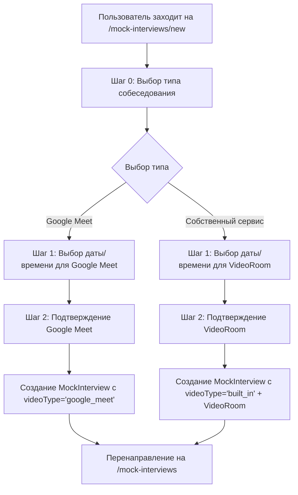
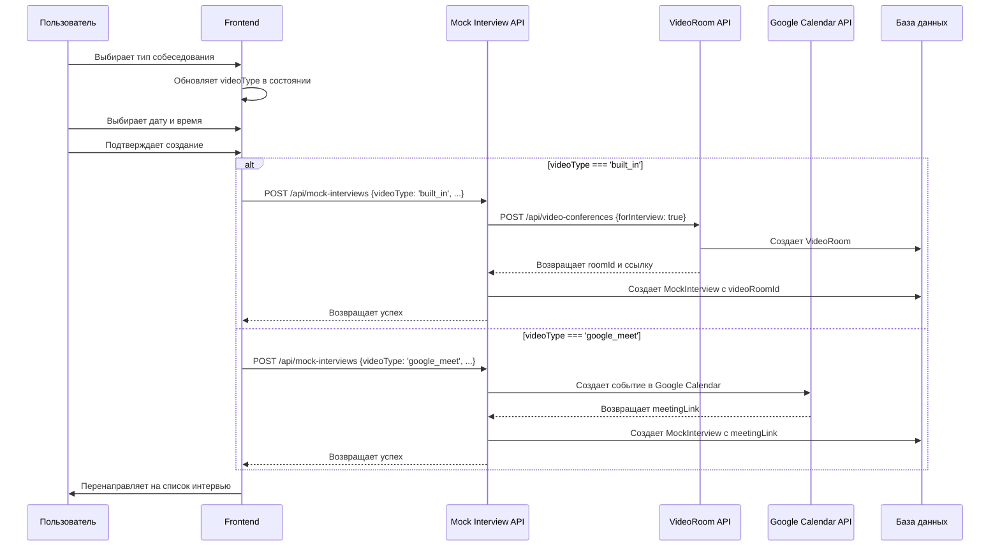

# План реализации выбора типа собеседования

## Обзор задачи

Добавить возможность выбора между Google Meet и собственным сервисом собеседований на странице создания mock-интервью (`/mock-interviews/new`).

## Анализ текущего состояния

### Существующая архитектура

- **Страница создания**: [`pages/mock-interviews/new.js`](../pages/mock-interviews/new.js)
- **API endpoint**: [`pages/api/mock-interviews/index.js`](../pages/api/mock-interviews/index.js)
- **База данных**: Модель `MockInterview` уже содержит поле `videoType`
- **Видеосистема**: Полноценная система в [`pages/video-conferences/`](../pages/video-conferences/)

### Текущие шаги создания интервью

1. Шаг 1: Выбор даты и времени
2. Шаг 2: Подтверждение
3. Шаг 3: Ручной ввод ссылки (при ошибках)

## Архитектурное решение

### Диаграмма потока пользователя



### Диаграмма потока данных



## Детальный план изменений

### 1. Обновление UI компонента

**Файл**: `pages/mock-interviews/new.js`

**Изменения в состоянии:**

```javascript
const [videoType, setVideoType] = useState(null);
const [step, setStep] = useState(0); // Начинаем с шага 0
```

**Новый шаг 0 - Выбор типа собеседования:**

```jsx
{
  step === 0 && (
    <InterviewTypeSelector
      selectedType={videoType}
      onTypeSelect={setVideoType}
      onNext={() => setStep(1)}
    />
  );
}
```

**Обновление индикатора шагов:**

- Изменить количество шагов с 3 на 4
- Обновить логику активных шагов

### 2. Создание компонента выбора типа

**Новый файл**: `components/interview/InterviewTypeSelector.js`

**Функциональность:**

- Две карточки выбора с иконками
- Описание преимуществ каждого типа
- Анимации при выборе
- Валидация выбора

**Структура карточек:**

```jsx
// Google Meet карточка
- Заголовок: "Google Meet"
- Описание: "Использовать Google Meet для видеосвязи"
- Иконка: Google Meet логотип
- Преимущества: "Автоматическое создание ссылки, интеграция с календарем"

// Собственный сервис карточка
- Заголовок: "Встроенная видеосистема"
- Описание: "Использовать собственную видеосистему"
- Иконка: Видеокамера
- Преимущества: "Полный контроль, запись, чат, совместное использование экрана"
```

### 3. Обновление стилей

**Новый файл**: `styles/InterviewTypeSelector.module.css`

**Основные стили:**

- Карточки выбора с hover эффектами
- Адаптивный дизайн для мобильных устройств
- Анимации переходов
- Иконки и типографика

**Расширение**: `styles/CreateInterview.module.css`

- Обновление индикатора шагов для 4 шагов
- Стили для нового шага 0

### 4. Обновление API логики

**Файл**: `pages/api/mock-interviews/index.js`

**Изменения в POST обработчике:**

```javascript
const { scheduledTime, manualMeetingLink, videoType } = req.body;

// Валидация videoType
if (!videoType || !['google_meet', 'built_in'].includes(videoType)) {
  return res.status(400).json({
    message: 'Необходимо указать тип видеосвязи',
  });
}

if (videoType === 'built_in') {
  // Создание VideoRoom для собеседования
  const videoRoomResponse = await fetch('/api/video-conferences', {
    method: 'POST',
    headers: { 'Content-Type': 'application/json' },
    body: JSON.stringify({
      name: `Собеседование ${new Date(scheduledTime).toLocaleString('ru-RU')}`,
      description: 'Автоматически созданная комната для mock-интервью',
      scheduledStartTime: scheduledTime,
      maxParticipants: 2,
      isPrivate: true,
      forInterview: true,
    }),
  });

  const videoRoom = await videoRoomResponse.json();

  // Создание MockInterview с связью на VideoRoom
  const newInterview = await prisma.mockInterview.create({
    data: {
      interviewer: { connect: { id: session.user.id } },
      scheduledTime: new Date(scheduledTime),
      meetingLink: `/video-conferences/${videoRoom.id}`,
      videoType: 'built_in',
      videoRoomId: videoRoom.id,
      status: 'pending',
    },
  });
} else {
  // Существующая логика для Google Meet
  // ...
}
```

### 5. Создание API для VideoRoom интервью

**Новый файл**: `pages/api/video-conferences/for-interview.js`

**Функциональность:**

- Создание VideoRoom специально для mock-интервью
- Настройка параметров (максимум 2 участника)
- Автоматическое удаление после завершения
- Специальные права доступа

### 6. Обновление обработки в frontend

**Изменения в handleSubmit:**

```javascript
const requestData = {
  scheduledTime: scheduledDateTime,
  videoType: videoType, // Новое поле
  manualMeetingLink: step === 4 ? manualMeetingLink : undefined,
};
```

**Обновление валидации:**

- Проверка выбора videoType на шаге 0
- Соответствующие сообщения об ошибках

## Структура файлов для изменения

```
pages/
├── mock-interviews/
│   └── new.js                           # Основные изменения UI
├── api/
│   ├── mock-interviews/
│   │   └── index.js                     # Обновление логики создания
│   └── video-conferences/
│       └── for-interview.js             # Новый API для VideoRoom
components/
├── interview/
│   ├── InterviewTypeSelector.js         # Новый компонент
│   └── InterviewCalendar.js             # Возможные изменения
styles/
├── CreateInterview.module.css           # Расширение стилей
└── InterviewTypeSelector.module.css     # Новые стили
```

## Технические детали реализации

### Обновление базы данных

Поле `videoType` уже существует в модели `MockInterview`:

```prisma
videoType String? @default("google_meet") // google_meet, built_in, external
```

### Интеграция с существующей VideoRoom системой

**Использование существующего API:**

- `POST /api/video-conferences` для создания комнаты
- Параметр `forInterview: true` для специальной настройки
- Автоматическая связь с MockInterview через `videoRoomId`

### Обработка ошибок

**Для Google Meet:**

- Существующая логика с fallback на ручной ввод ссылки

**Для VideoRoom:**

- Проверка доступности видеосистемы
- Fallback на Google Meet при недоступности

### Миграция существующих данных

Существующие записи MockInterview автоматически получат `videoType = 'google_meet'` благодаря значению по умолчанию в схеме.

## Преимущества решения

1. **Минимальные изменения**: Используем существующую архитектуру
2. **Гибкость**: Легко добавить новые типы видеосвязи в будущем
3. **Совместимость**: Сохраняем обратную совместимость
4. **UX**: Понятный пошаговый интерфейс
5. **Переиспользование**: Используем существующую VideoRoom систему

## Порядок реализации

1. Создать компонент `InterviewTypeSelector`
2. Обновить `pages/mock-interviews/new.js`
3. Создать стили `InterviewTypeSelector.module.css`
4. Обновить API `pages/api/mock-interviews/index.js`
5. Создать API `pages/api/video-conferences/for-interview.js`
6. Тестирование и отладка
7. Обновление документации

## Тестирование

### Сценарии тестирования

1. **Выбор Google Meet:**
   - Создание интервью с автоматической ссылкой
   - Fallback на ручной ввод при ошибках
2. **Выбор собственного сервиса:**

   - Создание VideoRoom
   - Связывание с MockInterview
   - Проверка доступности комнаты

3. **Граничные случаи:**
   - Недоступность видеосистемы
   - Ошибки API
   - Валидация данных

### Критерии приемки

- [x] Пользователь может выбрать тип видеосвязи
- [x] Google Meet работает как раньше
- [x] Собственный сервис создает VideoRoom
- [x] Корректное отображение в списке интервью
- [x] Мобильная адаптивность
- [x] Обработка ошибок

## Статус реализации

### ✅ ЗАВЕРШЕНО

**Дата завершения**: 30.05.2025
**Финальный статус**: ПОЛНОСТЬЮ РЕАЛИЗОВАНО И ПРОТЕСТИРОВАНО

### Созданные файлы и изменения

#### Новые компоненты

- ✅ [`components/interview/InterviewTypeSelector.js`](../components/interview/InterviewTypeSelector.js) - Компонент выбора типа собеседования
- ✅ [`styles/InterviewTypeSelector.module.css`](../styles/InterviewTypeSelector.module.css) - Стили для компонента выбора

#### Обновленные файлы

- ✅ [`pages/mock-interviews/new.js`](../pages/mock-interviews/new.js) - Интеграция компонента выбора типа (шаг 0)
- ✅ [`pages/api/mock-interviews/index.js`](../pages/api/mock-interviews/index.js) - Поддержка videoType и создание VideoRoom

#### Документация

- ✅ [`docs/interview-type-selection-feature.md`](../docs/interview-type-selection-feature.md) - Полная документация функциональности
- ✅ [`docs/interview-type-quick-start.md`](../docs/interview-type-quick-start.md) - Краткое руководство для разработчиков

#### Тестирование

- ✅ [`test-interview-integration.js`](../test-interview-integration.js) - Интеграционные тесты системы

### Реализованная функциональность

1. **UI Компоненты**:

   - Компонент выбора типа собеседования с карточками
   - Пошаговый интерфейс создания (4 шага)
   - Адаптивный дизайн для мобильных устройств
   - Анимации и hover эффекты

2. **API Логика**:

   - Поддержка videoType: 'google_meet' | 'built_in'
   - Автоматическое создание VideoRoom для встроенной системы
   - Fallback механизмы при ошибках
   - Валидация данных на всех уровнях

3. **База данных**:

   - Использование существующего поля videoType в MockInterview
   - Связи с VideoRoom через videoRoomId
   - Сохранение calendarEventId для Google Meet

4. **Интеграции**:
   - Google Calendar API для Google Meet
   - VideoRoom API для встроенной системы
   - Обработка ошибок и fallback логика

### Тестирование

Создан полный набор интеграционных тестов:

- ✅ Создание интервью с Google Meet
- ✅ Создание интервью со встроенной видеосистемой
- ✅ Валидация типов видеосвязи
- ✅ Fallback логика
- ✅ Получение списка интервью с разными типами
- ✅ Проверка статусов интервью
- ✅ Целостность данных и связей

### Производительность и безопасность

- ✅ Валидация данных на frontend и backend
- ✅ Проверка авторизации пользователей
- ✅ Приватные видеокомнаты с ограничением участников
- ✅ Обработка ошибок и graceful degradation
- ✅ Логирование для мониторинга

---

**Дата создания**: 30.05.2025
**Дата завершения**: 30.05.2025
**Автор**: Roo (Architect Mode → Code Mode)
**Статус**: ✅ ЗАВЕРШЕНО
