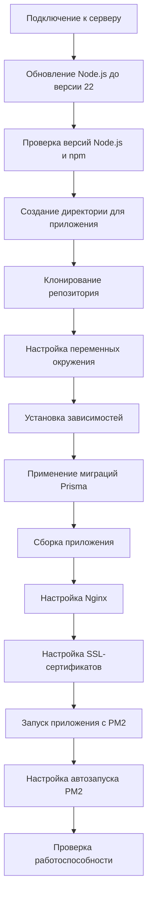

# Подробный план деплоя Next.js приложения на VPS сервер

## Диаграмма процесса деплоя



## 1. Подключение к серверу

```bash
# Подключение к серверу
ssh supermock
```

## 2. Обновление Node.js до версии 22

```bash
# Проверка текущей версии Node.js
node -v

# Установка NVM (Node Version Manager), если он еще не установлен
curl -o- https://raw.githubusercontent.com/nvm-sh/nvm/v0.39.3/install.sh | bash
source ~/.bashrc  # или source ~/.zshrc, если используется zsh

# Установка Node.js версии 22
nvm install 22

# Установка Node.js 22 как версии по умолчанию
nvm alias default 22

# Проверка, что Node.js обновлен до версии 22
node -v
```

## 3. Проверка версий Node.js и npm

```bash
# Проверка версии Node.js
node -v  # Должна быть версия 22.x.x

# Проверка версии npm
npm -v  # Должна быть версия 10.x.x или выше
```

## 4. Создание директории для приложения

```bash
# Создание директории для проекта
mkdir -p /root/supermock
mkdir -p /root/supermock/logs

# Переход в директорию проекта
cd /root/supermock
```

## 5. Клонирование репозитория

```bash
# Клонирование репозитория
git clone https://github.com/korobprog/TrenerFront.git .

# Если нужно переключиться на определенную ветку
# git checkout имя_ветки
```

## 6. Настройка переменных окружения

```bash
# Копирование файла .env.production в .env
cp .env.production .env

# Редактирование файла .env при необходимости
# nano .env
```

## 7. Установка зависимостей

```bash
# Установка зависимостей
npm ci
```

## 8. Применение миграций Prisma

```bash
# Применение миграций Prisma
npx prisma migrate deploy
```

## 9. Сборка приложения

```bash
# Сборка приложения
npm run build
```

## 10. Настройка Nginx

```bash
# Проверка наличия конфигурационного файла Nginx
ls -la /etc/nginx/sites-available/

# Копирование конфигурационного файла Nginx
sudo cp nginx.conf /etc/nginx/sites-available/supermock

# Создание символической ссылки в директории sites-enabled
sudo ln -s /etc/nginx/sites-available/supermock /etc/nginx/sites-enabled/

# Проверка конфигурации Nginx
sudo nginx -t

# Перезапуск Nginx
sudo systemctl restart nginx
```

## 11. Настройка SSL-сертификатов

```bash
# Проверка наличия SSL-сертификатов
ls -la /etc/nginx/sites-available/

# Если сертификаты уже настроены, пропустите этот шаг
# Если нужно настроить сертификаты:
# sudo apt-get update
# sudo apt-get install certbot python3-certbot-nginx
# sudo certbot --nginx -d supermock.example.com
```

## 12. Запуск приложения с PM2

```bash
# Проверка, установлен ли PM2
pm2 -v

# Если PM2 не установлен, установите его
npm install -g pm2

# Запуск приложения с PM2
pm2 start ecosystem.config.js

# Сохранение конфигурации PM2
pm2 save
```

## 13. Настройка автозапуска PM2

```bash
# Настройка автозапуска PM2 при перезагрузке сервера
pm2 startup

# Выполните команду, которую выдаст предыдущая команда
# Обычно это что-то вроде:
# sudo env PATH=$PATH:/usr/bin /usr/lib/node_modules/pm2/bin/pm2 startup systemd -u root --hp /root
```

## 14. Проверка работоспособности

```bash
# Проверка статуса приложения
pm2 status

# Проверка логов приложения
pm2 logs supermock

# Проверка доступности приложения через браузер
# Откройте в браузере https://supermock.example.com
```

## 15. Обновление приложения (при необходимости)

```bash
# Переход в директорию проекта
cd /root/supermock

# Получение последних изменений из репозитория
git pull

# Установка зависимостей
npm ci

# Применение миграций Prisma
npx prisma migrate deploy

# Сборка приложения
npm run build

# Перезапуск приложения
pm2 reload supermock
```

## 16. Решение проблем

### Проблемы с Nginx

```bash
# Проверка логов Nginx
sudo tail -f /var/log/nginx/supermock.error.log
```

### Проблемы с приложением

```bash
# Проверка логов приложения
pm2 logs supermock
```

### Проблемы с базой данных

```bash
# Проверка статуса Docker контейнеров
docker ps

# Проверка логов контейнера с базой данных
docker logs trenerfront_postgres
```
