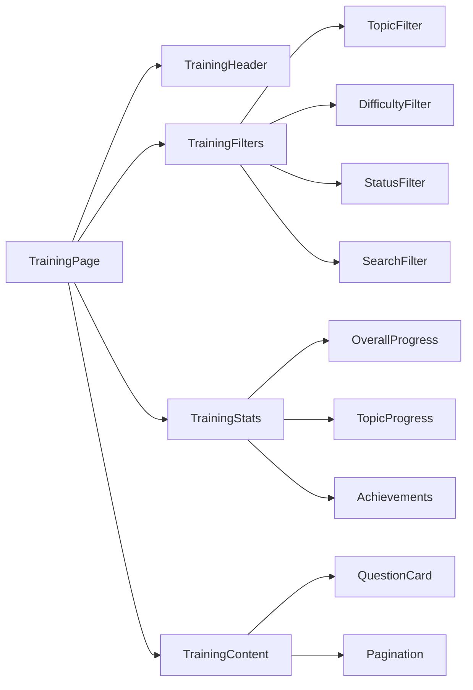
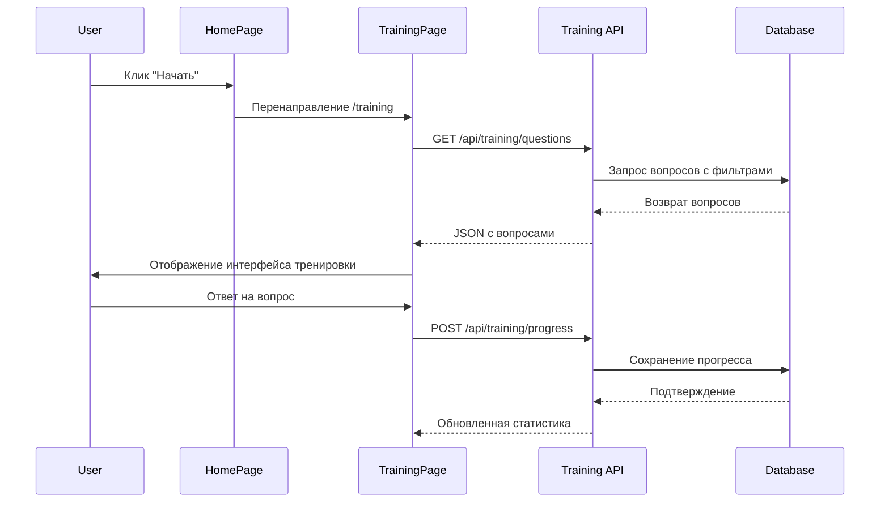

# План реализации страницы тренировок

## 📋 Обзор проекта

**Цель:** Вынести функциональность тренировочных вопросов с главной страницы на отдельную страницу `/training` с расширенным функционалом.

**Дата создания:** 27.05.2025  
**Статус:** Готов к реализации

## 🏗️ Анализ текущей архитектуры

### Система авторизации

- **NextAuth.js** с поддержкой Google OAuth, GitHub и Credentials
- **Prisma** как ORM с адаптером для NextAuth
- **JWT стратегия** для сессий (24 часа)
- **Роли пользователей** (user, admin, superadmin)
- **Middleware** для защиты админских маршрутов

### Контексты

- `SessionProvider` - глобальное управление сессиями
- `NotificationProvider` - система уведомлений

### Текущая реализация тренировок

**На главной странице (`pages/index.js`):**

- Секция "Тренировочные вопросы" (строки 212-289)
- Условная кнопка "Начать" для авторизованных пользователей
- Встроенная логика тренировки с состояниями `isStarted`, `questions`, `currentIndex`

**API endpoints:**

- `/api/questions` - получение вопросов с фильтрацией по прогрессу
- `/api/progress` - сохранение прогресса пользователя

**Компоненты:**

- `QuestionCard` - отображение вопроса с кнопками ответов и статистикой

## 🎯 План реализации

### Этап 1: Рефакторинг главной страницы

**Задачи:**

1. Удалить логику тренировки из `pages/index.js` (строки 17-73)
2. Изменить кнопку "Начать" на перенаправление к `/training`
3. Упростить компонент до презентационного

**Изменения в `pages/index.js`:**

```javascript
// Заменить onClick={() => setIsStarted(true)} на:
onClick={() => router.push('/training')}

// Удалить состояния:
// - questions, setQuestions
// - currentIndex, setCurrentIndex
// - isStarted, setIsStarted
// - isLoading, setIsLoading
// - error, setError

// Удалить функции:
// - fetchQuestions()
// - handleAnswer()
// - handleSearch()
```

### Этап 2: Создание страницы тренировок

**Новые файлы:**

1. `pages/training/index.js` - основная страница тренировок
2. `styles/Training.module.css` - стили для страницы тренировок

**Структура компонентов:**

```
TrainingPage
├── TrainingHeader
├── TrainingFilters
│   ├── TopicFilter
│   ├── DifficultyFilter
│   ├── StatusFilter
│   └── SearchFilter
├── TrainingStats
│   ├── OverallProgress
│   ├── TopicProgress
│   └── Achievements
└── TrainingContent
    ├── QuestionCard (переиспользуем)
    └── Pagination
```

### Этап 3: Расширение API

**Новые API endpoints:**

1. **`pages/api/training/questions.js`**

   - Расширенная фильтрация по темам, сложности, статусу
   - Пагинация
   - Поиск по тексту
   - Сортировка

2. **`pages/api/training/stats.js`**

   - Общая статистика пользователя
   - Прогресс по темам
   - Достижения
   - Временная статистика

3. **`pages/api/training/topics.js`**
   - Список доступных тем
   - Статистика по темам
   - Количество вопросов в каждой теме

### Этап 4: Новые компоненты

**Компоненты тренировок:**

1. **`components/training/TrainingDashboard.js`**

   - Основной контейнер
   - Управление состоянием фильтров
   - Координация между компонентами

2. **`components/training/TrainingFilters.js`**

   - Фильтры по темам, сложности, статусу
   - Поиск по тексту
   - Сброс фильтров

3. **`components/training/TrainingStats.js`**

   - Статистика прогресса
   - Графики и диаграммы
   - Достижения пользователя

4. **`components/training/QuestionsList.js`**
   - Список вопросов с пагинацией
   - Использует существующий `QuestionCard`
   - Бесконечная прокрутка (опционально)

### Этап 5: Расширение базы данных

**Новые поля в таблице `Question`:**

```sql
ALTER TABLE Question ADD COLUMN topic VARCHAR(100);
ALTER TABLE Question ADD COLUMN difficulty ENUM('easy', 'medium', 'hard');
ALTER TABLE Question ADD COLUMN tags JSON;
ALTER TABLE Question ADD COLUMN estimatedTime INT; -- время в секундах
```

**Новая таблица для достижений:**

```sql
CREATE TABLE Achievement (
  id INT PRIMARY KEY AUTO_INCREMENT,
  userId INT,
  type VARCHAR(50), -- 'streak', 'topic_master', 'speed_demon', etc.
  title VARCHAR(200),
  description TEXT,
  unlockedAt DATETIME,
  metadata JSON, -- дополнительные данные
  FOREIGN KEY (userId) REFERENCES User(id)
);
```

**Расширение таблицы `UserProgress`:**

```sql
ALTER TABLE UserProgress ADD COLUMN timeSpent INT; -- время в секундах
ALTER TABLE UserProgress ADD COLUMN streak INT DEFAULT 0;
ALTER TABLE UserProgress ADD COLUMN lastStreakDate DATE;
```

### Этап 6: Улучшение UX

**Дополнительные функции:**

1. **Прогресс-бар** для текущей сессии
2. **Таймер** для отслеживания времени
3. **Режимы тренировки:**
   - Изучение (новые вопросы)
   - Повторение (неправильные ответы)
   - Экзамен (случайные вопросы)
   - Спринт (на время)
4. **Избранные вопросы**
5. **Экспорт прогресса** в PDF/CSV
6. **Темная тема**
7. **Горячие клавиши** для быстрых ответов

## 📊 Диаграммы архитектуры

### Поток навигации

```mermaid
graph TD
    A[Главная страница] -->|Клик "Начать"| B{Проверка авторизации}
    B -->|Не авторизован| C[Перенаправление на /auth/signin]
    B -->|Авторизован| D[Перенаправление на /training]

    D --> E[Страница тренировок /training]
    E --> F[Загрузка компонентов]
    F --> G[TrainingDashboard]
    F --> H[TrainingFilters]
    F --> I[TrainingStats]
    F --> J[QuestionCard]

    G --> K[API: /api/training/questions]
    G --> L[API: /api/training/stats]
    G --> M[API: /api/training/progress]

    H --> N[Фильтрация по темам]
    H --> O[Фильтрация по сложности]
    H --> P[Фильтрация по статусу]

    I --> Q[Общая статистика]
    I --> R[Прогресс по темам]
    I --> S[Достижения]
```

### Структура компонентов



### Поток данных



## 🔧 Технические детали

### Состояние компонента TrainingPage

```javascript
const [questions, setQuestions] = useState([]);
const [currentQuestion, setCurrentQuestion] = useState(0);
const [filters, setFilters] = useState({
  topic: 'all',
  difficulty: 'all',
  status: 'all',
  search: '',
  mode: 'study', // study, review, exam, sprint
});
const [stats, setStats] = useState({
  totalQuestions: 0,
  answeredQuestions: 0,
  correctAnswers: 0,
  streak: 0,
  timeSpent: 0,
});
const [isLoading, setIsLoading] = useState(false);
const [currentMode, setCurrentMode] = useState('study');
```

### Защита маршрута

```javascript
// В pages/training/index.js
useEffect(() => {
  if (status === 'unauthenticated') {
    router.push('/auth/signin?callbackUrl=/training');
  }
}, [status, router]);
```

### API структура

**GET /api/training/questions**

```javascript
// Query параметры
{
  topic?: string,
  difficulty?: 'easy' | 'medium' | 'hard',
  status?: 'all' | 'new' | 'known' | 'unknown' | 'repeat',
  search?: string,
  page?: number,
  limit?: number,
  mode?: 'study' | 'review' | 'exam' | 'sprint'
}

// Ответ
{
  questions: Question[],
  pagination: {
    page: number,
    limit: number,
    total: number,
    totalPages: number
  },
  filters: {
    availableTopics: string[],
    availableDifficulties: string[]
  }
}
```

**GET /api/training/stats**

```javascript
// Ответ
{
  overall: {
    totalQuestions: number,
    answeredQuestions: number,
    correctAnswers: number,
    accuracy: number,
    streak: number,
    totalTimeSpent: number
  },
  byTopic: {
    [topic: string]: {
      total: number,
      answered: number,
      correct: number,
      accuracy: number
    }
  },
  achievements: Achievement[],
  recentActivity: {
    date: string,
    questionsAnswered: number,
    timeSpent: number
  }[]
}
```

## ✅ Критерии готовности

### Этап 1 - Готов

- [ ] Рефакторинг главной страницы
- [ ] Кнопка перенаправляет на /training
- [ ] Удалена логика тренировки с главной страницы

### Этап 2 - Готов

- [ ] Создана страница /training
- [ ] Базовый интерфейс работает
- [ ] Защита авторизацией работает

### Этап 3 - Готов

- [ ] API endpoints созданы и работают
- [ ] Фильтрация работает корректно
- [ ] Пагинация реализована

### Этап 4 - Готов

- [ ] Все компоненты созданы
- [ ] Компоненты интегрированы
- [ ] UI/UX соответствует дизайну

### Этап 5 - Готов

- [ ] База данных расширена
- [ ] Миграции выполнены
- [ ] Данные корректно сохраняются

### Этап 6 - Готов

- [ ] Дополнительные функции реализованы
- [ ] Тестирование завершено
- [ ] Документация обновлена

## 🚀 Следующие шаги

1. **Переключиться в режим Code** для начала реализации
2. **Начать с Этапа 1** - рефакторинг главной страницы
3. **Последовательно выполнить все этапы**
4. **Тестировать каждый этап** перед переходом к следующему

## 📝 Примечания

- Существующий компонент `QuestionCard` будет переиспользован
- API `/api/questions` и `/api/progress` будут расширены, но не заменены
- Совместимость с существующей системой авторизации сохранена
- План предусматривает постепенную миграцию без нарушения работы

---

**Автор:** Roo (Architect Mode)  
**Дата:** 27.05.2025  
**Версия:** 1.0
