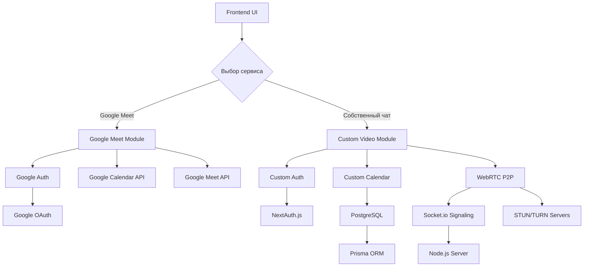
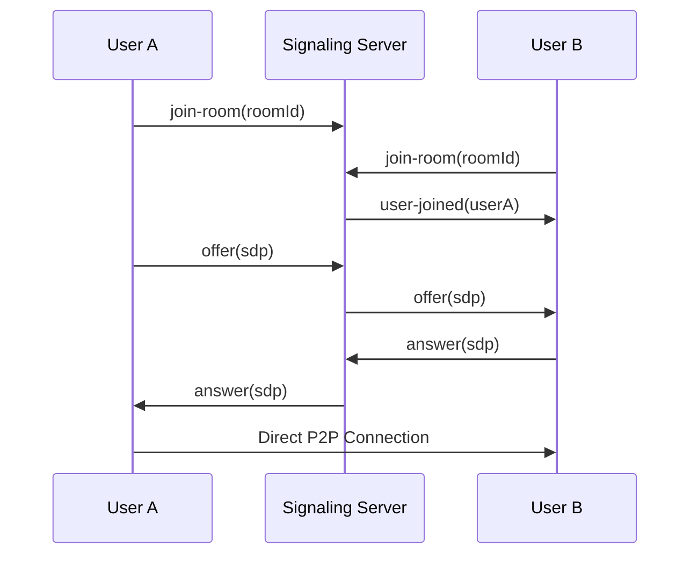
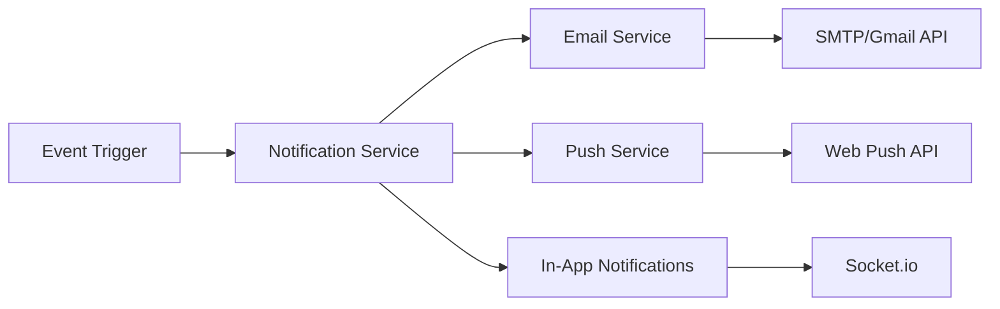

# Архитектура гибридной системы видеоконференций

## Общий обзор

Гибридная система видеоконференций предоставляет пользователям выбор между двумя режимами:

1. **Google Meet интеграция** (существующий функционал)
2. **Собственный видеочат с календарем** (новый сервис)

## Архитектурные принципы

### 1. Модульность

- Независимые модули для каждого типа видеосвязи
- Общие компоненты для UI и управления пользователями
- Возможность отключения любого модуля без влияния на систему

### 2. Выбор пользователя

- UI переключатель между режимами
- Сохранение предпочтений пользователя
- Динамическая загрузка компонентов

### 3. Безопасность

- Изолированная авторизация для каждого сервиса
- Шифрование P2P соединений
- Контроль доступа к календарным данным

## Архитектура системы



## Компоненты системы

### Frontend компоненты

#### Общие компоненты

- [`ServiceSelector`](components/ServiceSelector.js) - выбор между Google Meet и собственным чатом
- [`MeetingScheduler`](components/MeetingScheduler.js) - общий интерфейс планирования
- [`NotificationCenter`](components/NotificationCenter.js) - центр уведомлений

#### Google Meet модуль

- [`GoogleMeetIntegration`](components/GoogleMeet/GoogleMeetIntegration.js) - существующий функционал
- [`GoogleCalendarSync`](components/GoogleMeet/GoogleCalendarSync.js) - синхронизация с Google Calendar

#### Собственный видеочат модуль

- [`CustomVideoChat`](components/CustomVideo/CustomVideoChat.js) - P2P видеочат
- [`CustomCalendar`](components/CustomVideo/CustomCalendar.js) - собственный календарь
- [`RoomManager`](components/CustomVideo/RoomManager.js) - управление комнатами

### Backend API

#### Общие API

- [`/api/user/preferences`](pages/api/user/preferences.js) - настройки пользователя
- [`/api/meetings/schedule`](pages/api/meetings/schedule.js) - планирование встреч

#### Google Meet API (существующие)

- [`/api/google/auth`](pages/api/google/auth.js) - авторизация Google
- [`/api/google/calendar`](pages/api/google/calendar.js) - работа с Google Calendar
- [`/api/google/meet`](pages/api/google/meet.js) - создание Google Meet

#### Собственный видеочат API

- [`/api/custom/rooms`](pages/api/custom/rooms.js) - управление комнатами
- [`/api/custom/calendar`](pages/api/custom/calendar.js) - собственный календарь
- [`/api/custom/signaling`](pages/api/custom/signaling.js) - WebRTC signaling

## Модели данных

### Расширение существующей схемы

```prisma
// Добавление к существующей схеме Prisma

model UserPreferences {
  id                String   @id @default(cuid())
  userId            String   @unique
  preferredService  String   @default("google") // "google" | "custom"
  customSettings    Json?    // Настройки собственного чата
  googleSettings    Json?    // Настройки Google интеграции
  createdAt         DateTime @default(now())
  updatedAt         DateTime @updatedAt

  user              User     @relation(fields: [userId], references: [id])

  @@map("user_preferences")
}

model CustomCalendarEvent {
  id          String   @id @default(cuid())
  title       String
  description String?
  startTime   DateTime
  endTime     DateTime
  userId      String
  attendees   Json     // Массив участников
  roomId      String?  // ID комнаты для видеочата
  status      EventStatus @default(SCHEDULED)
  createdAt   DateTime @default(now())
  updatedAt   DateTime @updatedAt

  user        User     @relation(fields: [userId], references: [id])
  room        VideoRoom? @relation(fields: [roomId], references: [id])

  @@map("custom_calendar_events")
}

model VideoRoom {
  id          String   @id @default(cuid())
  name        String
  hostId      String
  isActive    Boolean  @default(true)
  maxUsers    Int      @default(10)
  createdAt   DateTime @default(now())
  updatedAt   DateTime @updatedAt

  host        User     @relation(fields: [hostId], references: [id])
  events      CustomCalendarEvent[]

  @@map("video_rooms")
}

enum EventStatus {
  SCHEDULED
  IN_PROGRESS
  COMPLETED
  CANCELLED
}
```

## Технологический стек

### Frontend

- **React/Next.js** - основной фреймворк
- **WebRTC API** - P2P видеосвязь
- **Socket.io-client** - real-time коммуникация
- **React Big Calendar** - календарный компонент
- **Material-UI/Tailwind** - UI компоненты

### Backend

- **Node.js/Next.js API** - серверная логика
- **Socket.io** - WebRTC signaling сервер
- **Prisma ORM** - работа с базой данных
- **NextAuth.js** - аутентификация
- **Google APIs** - интеграция с Google сервисами

### Инфраструктура

- **PostgreSQL** - основная база данных
- **Redis** - кэширование и сессии (опционально)
- **STUN/TURN серверы** - NAT traversal для WebRTC
- **Docker** - контейнеризация

## Интеграция с существующим кодом

### Точки интеграции

1. **Модель User** - добавление связи с [`UserPreferences`](prisma/schema.prisma:27)
2. **MockInterview** - расширение для поддержки собственных комнат
3. **Существующие API** - сохранение обратной совместимости

### Миграционная стратегия

```sql
-- Добавление новых таблиц без изменения существующих
ALTER TABLE "MockInterview" ADD COLUMN "serviceType" VARCHAR(20) DEFAULT 'google';
ALTER TABLE "MockInterview" ADD COLUMN "customRoomId" TEXT;
```

## WebRTC P2P архитектура

### Signaling сервер



### Конфигурация WebRTC

```javascript
const webrtcConfig = {
  iceServers: [
    { urls: 'stun:stun.l.google.com:19302' },
    { urls: 'stun:stun1.l.google.com:19302' },
    // Собственный TURN сервер для продакшена
    {
      urls: 'turn:your-turn-server.com:3478',
      username: process.env.TURN_USERNAME,
      credential: process.env.TURN_PASSWORD,
    },
  ],
};
```

## Система уведомлений

### Архитектура уведомлений



### Типы уведомлений

1. **Email уведомления** - приглашения на встречи
2. **Push уведомления** - напоминания
3. **In-app уведомления** - статусы комнат

## Планировщик задач

### Cron задачи

```javascript
// Проверка предстоящих встреч каждую минуту
cron.schedule('* * * * *', async () => {
  await checkUpcomingMeetings();
});

// Очистка неактивных комнат каждый час
cron.schedule('0 * * * *', async () => {
  await cleanupInactiveRooms();
});
```

## Безопасность

### Аутентификация

1. **Google OAuth** - для Google Meet режима
2. **NextAuth.js** - для собственного режима
3. **JWT токены** - для API авторизации

### Шифрование

1. **DTLS** - шифрование WebRTC трафика
2. **HTTPS** - защищенные API вызовы
3. **Database encryption** - шифрование чувствительных данных

## Масштабирование

### Горизонтальное масштабирование

1. **Load Balancer** - распределение нагрузки
2. **Multiple signaling servers** - кластер Socket.io серверов
3. **Database sharding** - разделение данных

### Оптимизация производительности

1. **CDN** - статические ресурсы
2. **Redis caching** - кэширование API ответов
3. **Connection pooling** - пул соединений с БД

## Мониторинг и логирование

### Метрики

1. **WebRTC качество** - качество видео/аудио
2. **API производительность** - время ответа
3. **Пользовательская активность** - использование сервисов

### Логирование

```javascript
// Структурированное логирование
logger.info('Room created', {
  roomId: room.id,
  hostId: room.hostId,
  service: 'custom',
  timestamp: new Date().toISOString(),
});
```

## Развертывание

### Docker конфигурация

```dockerfile
# Расширение существующего Dockerfile
FROM node:18-alpine

# Добавление WebRTC зависимостей
RUN apk add --no-cache \
    python3 \
    make \
    g++

# Установка дополнительных зависимостей
COPY package*.json ./
RUN npm install

# Копирование исходного кода
COPY . .

# Сборка приложения
RUN npm run build

EXPOSE 3000 3001

CMD ["npm", "start"]
```

### Environment переменные

```env
# WebRTC конфигурация
NEXT_PUBLIC_SIGNALING_SERVER=ws://localhost:3001
TURN_SERVER_URL=turn:your-turn-server.com:3478
TURN_USERNAME=username
TURN_PASSWORD=password

# Существующие переменные остаются без изменений
GOOGLE_CLIENT_ID=your_google_client_id
GOOGLE_CLIENT_SECRET=your_google_client_secret
```

## Тестирование

### Типы тестов

1. **Unit тесты** - компоненты и утилиты
2. **Integration тесты** - API endpoints
3. **E2E тесты** - пользовательские сценарии
4. **WebRTC тесты** - качество соединения

### Тестовые сценарии

```javascript
// Пример E2E теста
describe('Video Conference Flow', () => {
  it('should create custom video room', async () => {
    await page.goto('/meetings/schedule');
    await page.click('[data-testid="service-custom"]');
    await page.fill('[data-testid="meeting-title"]', 'Test Meeting');
    await page.click('[data-testid="create-meeting"]');

    expect(await page.textContent('[data-testid="room-link"]')).toContain(
      '/room/'
    );
  });
});
```

## Следующие шаги

1. **Этап 1**: Настройка инфраструктуры и базовых компонентов
2. **Этап 2**: Реализация WebRTC видеочата
3. **Этап 3**: Интеграция собственного календаря
4. **Этап 4**: Система уведомлений и планировщик
5. **Этап 5**: Тестирование и оптимизация

## Риски и митигация

### Технические риски

1. **WebRTC совместимость** → Полифиллы и fallback на Google Meet
2. **NAT traversal проблемы** → Настройка TURN сервера
3. **Производительность** → Оптимизация кодеков и сжатие

### Операционные риски

1. **Нагрузка на сервер** → Горизонтальное масштабирование
2. **Отказ сервисов** → Fallback механизмы
3. **Потеря данных** → Регулярные бэкапы
