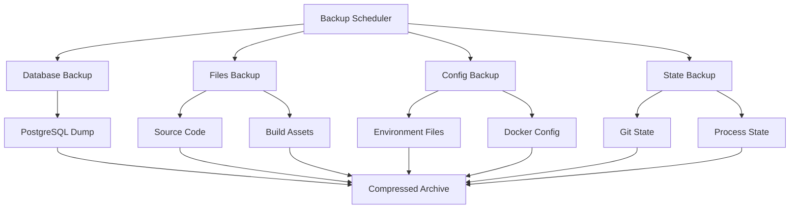

# Руководство по резервному копированию и восстановлению

## Гибридная система видеоконференций

## Обзор системы резервного копирования

Комплексная система автоматического резервного копирования для поэтапной разработки гибридной системы видеоконференций с поддержкой Google Meet и собственного видеочата.

## Архитектура резервного копирования



## Типы резервных копий

### 1. Полные резервные копии (Full Backup)

**Содержимое:**

- База данных PostgreSQL (полный дамп)
- Все файлы проекта
- Конфигурационные файлы (.env, docker-compose.yml)
- Git состояние и метаданные

**Частота:** Перед началом каждого этапа разработки
**Расположение:** `backups/full/`
**Размер:** ~500MB - 2GB

### 2. Снимки этапов (Stage Snapshots)

**Содержимое:**

- Состояние проекта на момент завершения этапа
- Метаданные о версии и изменениях
- Результаты тестирования этапа
- Документация прогресса

**Частота:** После завершения каждого этапа
**Расположение:** `backups/stages/`
**Размер:** ~200MB - 1GB

### 3. Резервные копии базы данных (Database Only)

**Содержимое:**

- PostgreSQL дамп с данными
- Схема базы данных
- Индексы и ограничения

**Частота:** Перед каждым изменением схемы
**Расположение:** `backups/database/`
**Размер:** ~5MB - 50MB

### 4. Инкрементальные резервные копии

**Содержимое:**

- Только измененные файлы с последнего бэкапа
- Дельта изменений базы данных
- Новые логи

**Частота:** Ежедневно во время активной разработки
**Расположение:** `backups/incremental/`
**Размер:** ~10MB - 100MB

## Автоматическое резервное копирование

### Настройка cron задач

```bash
# Ежедневное инкрементальное резервное копирование в 2:00
0 2 * * * /path/to/video-conference-development/backups/backup-script.sh incremental

# Еженедельное полное резервное копирование в воскресенье в 1:00
0 1 * * 0 /path/to/video-conference-development/backups/backup-script.sh full

# Ежемесячное архивирование старых резервных копий
0 3 1 * * /path/to/video-conference-development/backups/archive-old-backups.sh
```

### Использование backup-script.sh

```bash
# Создание полной резервной копии
./backups/backup-script.sh full

# Создание резервной копии конкретного этапа
./backups/backup-script.sh stage stage-02-webrtc-video

# Создание инкрементальной резервной копии
./backups/backup-script.sh incremental

# Создание резервной копии только БД
./backups/backup-script.sh database

# Создание резервной копии с пользовательским именем
./backups/backup-script.sh custom "pre-production-deploy"

# Создание резервной копии с исключениями
./backups/backup-script.sh full --exclude="node_modules,*.log"
```

### Контрольные точки разработки

```bash
# Перед началом этапа
./backups/backup-script.sh checkpoint-stage-02-start

# После завершения основной функциональности
./backups/backup-script.sh checkpoint-stage-02-core

# Перед интеграцией с существующим кодом
./backups/backup-script.sh checkpoint-stage-02-integration

# После завершения этапа
./backups/backup-script.sh checkpoint-stage-02-complete
```

## Восстановление из резервных копий

### Полное восстановление системы

```bash
# Восстановление из полной резервной копии
./backups/restore-script.sh full 20250529_143000

# Восстановление конкретного этапа
./backups/restore-script.sh stage stage-02-webrtc-video

# Восстановление с проверкой целостности
./backups/restore-script.sh full 20250529_143000 --verify

# Восстановление в тестовую среду
./backups/restore-script.sh full 20250529_143000 --target=staging
```

### Восстановление только базы данных

```bash
# Восстановление БД из дампа
./backups/restore-script.sh database 20250529_143000

# Восстановление БД с пересозданием
./backups/restore-script.sh database 20250529_143000 --recreate

# Восстановление в другую БД
./backups/restore-script.sh database 20250529_143000 --target-db=test_db
```

### Частичное восстановление

```bash
# Восстановление только файлов проекта
./backups/restore-script.sh files stage-01-infrastructure

# Восстановление только конфигурации
./backups/restore-script.sh config full_20250529_143000

# Восстановление конкретных компонентов
./backups/restore-script.sh components "CustomVideo,GoogleMeet" stage-02
```

## Процедура быстрого отката

### Критерии для отката

1. **Критические ошибки в production**

   - Полная неработоспособность системы
   - Потеря данных пользователей
   - Серьезные уязвимости безопасности

2. **Проблемы производительности**

   - Время отклика > 5 секунд
   - Высокое потребление ресурсов
   - Частые сбои соединений

3. **Конфликты с существующим функционалом**
   - Нарушение работы Google Meet интеграции
   - Проблемы с авторизацией

### Процедура быстрого отката

```bash
# 1. Остановка сервисов
pm2 stop all

# 2. Откат к предыдущей версии
git checkout v1.0.0  # последняя стабильная версия

# 3. Восстановление базы данных
./backups/restore-script.sh database pre-stage-02

# 4. Восстановление файлов
./backups/restore-script.sh files pre-stage-02

# 5. Перезапуск сервисов
npm install
npm run build
pm2 start ecosystem.config.js

# 6. Проверка работоспособности
npm run test:smoke
```

## Структура резервных копий

### Именование файлов

```
backups/
├── full/                           # Полные резервные копии
│   ├── full_20250529_143000.tar.gz
│   ├── full_20250530_020000.tar.gz
│   └── pre_production_deploy.tar.gz
├── stages/                         # Резервные копии этапов
│   ├── stage-01-infrastructure_20250529_100000.tar.gz
│   ├── stage-02-webrtc-video_20250530_150000.tar.gz
│   ├── stage-03-calendar-integration_20250531_120000.tar.gz
│   ├── stage-04-notifications_20250601_140000.tar.gz
│   └── stage-05-testing-optimization_20250602_160000.tar.gz
├── database/                       # Резервные копии БД
│   ├── database_20250529_143000.sql.gz
│   ├── pre_migration_20250530_100000.sql.gz
│   └── pre_restore_20250530_150000.sql
├── incremental/                    # Инкрементальные копии
│   ├── incremental_20250529_020000.tar.gz
│   ├── incremental_20250530_020000.tar.gz
│   └── incremental_20250531_020000.tar.gz
├── archive/                        # Архивные копии
│   ├── 2025-05/
│   └── 2025-04/
└── logs/                          # Логи операций
    ├── backup.log
    ├── restore.log
    └── verification.log
```

### Содержимое полной резервной копии

```
full_backup.tar.gz
├── backup/
│   ├── database.sql                # Дамп PostgreSQL
│   ├── project/                    # Файлы проекта
│   │   ├── components/
│   │   ├── pages/
│   │   ├── lib/
│   │   ├── styles/
│   │   ├── prisma/
│   │   ├── package.json
│   │   ├── next.config.js
│   │   └── ecosystem.config.js
│   ├── config/                     # Конфигурационные файлы
│   │   ├── .env.local
│   │   ├── .env.production
│   │   ├── docker-compose.yml
│   │   └── nginx.conf
│   ├── metadata/                   # Метаданные
│   │   ├── backup-metadata.json
│   │   ├── git-log.txt
│   │   ├── git-status.txt
│   │   └── git-branches.txt
│   └── verification/               # Данные для проверки
│       ├── checksums.md5
│       └── file-list.txt
```

### Содержимое резервной копии этапа

```
stage-02-webrtc-video_backup.tar.gz
├── stage_backup/
│   ├── database.sql                # Состояние БД на момент этапа
│   ├── stage-02-webrtc-video/      # Файлы этапа
│   │   ├── components/
│   │   ├── api/
│   │   ├── progress.md
│   │   ├── README.md
│   │   └── rollback.md
│   ├── related_files/              # Связанные файлы
│   │   ├── package.json
│   │   ├── prisma/schema.prisma
│   │   └── lib/webrtc/
│   └── stage-metadata.json         # Метаданные этапа
```

## Автоматические снимки состояния

### Git hooks для автоматических снимков

```bash
# .git/hooks/pre-commit
#!/bin/bash
# Создание снимка перед коммитом в main
if [ "$(git branch --show-current)" = "main" ]; then
    ./backups/backup-script.sh incremental
fi

# .git/hooks/pre-push
#!/bin/bash
# Создание снимка перед push в production
if git log --oneline -1 | grep -q "release"; then
    ./backups/backup-script.sh full "pre-release-$(date +%Y%m%d)"
fi
```

### Снимки перед критическими операциями

```bash
# Перед миграцией базы данных
npx prisma migrate deploy --create-only
./backups/backup-script.sh database "pre-migration-$(date +%Y%m%d_%H%M%S)"
npx prisma migrate deploy

# Перед развертыванием в production
./backups/backup-script.sh full "pre-production-$(date +%Y%m%d_%H%M%S)"
npm run deploy:production
```

## Проверка целостности

### Автоматическая проверка

```bash
# Проверка целостности резервной копии
./backups/verify-backup.sh stage-01-infrastructure

# Проверка всех резервных копий
./backups/verify-all-backups.sh

# Тестовое восстановление в изолированной среде
./backups/test-restore.sh stage-01-infrastructure
```

### Верификация данных

```bash
# Проверка контрольных сумм
md5sum -c backups/full/checksums.md5

# Проверка целостности архива
tar -tzf backups/full/full_20250529_143000.tar.gz > /dev/null

# Проверка подключения к БД после восстановления
psql -h localhost -U postgres -d trener_db -c "SELECT 1;"
```

## Мониторинг резервного копирования

### Логирование операций

```bash
# Структура логов
backups/logs/
├── backup.log          # Логи создания резервных копий
├── restore.log         # Логи восстановления
├── verification.log    # Логи проверки целостности
└── cleanup.log         # Логи очистки старых копий
```

### Метрики и уведомления

```bash
# Мониторинг размера резервных копий
du -sh backups/* | tee backups/logs/size-report.log

# Проверка доступного места
df -h | grep -E "(/$|/var)" | tee backups/logs/disk-usage.log

# Уведомления об ошибках (настройка в crontab)
MAILTO=admin@example.com
```

## Политика хранения и архивирование

### Ротация резервных копий

- **Инкрементальные**: хранятся 30 дней
- **Полные**: хранятся 6 месяцев
- **Этапов**: хранятся постоянно
- **Критические снимки**: хранятся 1 год

### Автоматическая очистка

```bash
# Очистка старых инкрементальных копий (старше 30 дней)
find backups/incremental/ -name "*.tar.gz" -mtime +30 -delete

# Архивирование старых полных копий (старше 6 месяцев)
find backups/full/ -name "*.tar.gz" -mtime +180 -exec mv {} backups/archive/ \;

# Сжатие архивных копий
find backups/archive/ -name "*.tar.gz" -exec gzip {} \;
```

## Аварийное восстановление

### Сценарии аварийного восстановления

#### 1. Полный сбой системы

```bash
# Процедура восстановления
1. Оценка ущерба и выбор точки восстановления
2. Подготовка новой инфраструктуры
3. Восстановление базы данных
4. Восстановление файлов приложения
5. Восстановление конфигурации
6. Тестирование работоспособности
7. Переключение DNS и уведомление пользователей
```

#### 2. Повреждение базы данных

```bash
# Быстрое восстановление БД
./backups/restore-script.sh database latest --verify
systemctl restart postgresql
npm run test:database
```

#### 3. Откат неудачного развертывания

```bash
# Откат к предыдущей версии
git checkout HEAD~1
./backups/restore-script.sh database pre-deployment
pm2 restart all
```

### Контакты экстренного реагирования

```
Системный администратор: admin@example.com
Ведущий разработчик: lead-dev@example.com
Техническая поддержка: support@example.com
Дежурный инженер: +7-XXX-XXX-XXXX
```

## Тестирование процедур восстановления

### Регулярное тестирование

```bash
# Ежемесячное тестирование восстановления
./backups/test-restore.sh full latest --environment=test

# Тестирование отката этапов
./backups/test-rollback.sh stage-02-webrtc-video

# Проверка времени восстановления
time ./backups/restore-script.sh database latest
```

### Документирование результатов

```markdown
## Отчет о тестировании восстановления

**Дата:** 2025-05-30
**Тип теста:** Полное восстановление
**Результат:** Успешно
**Время восстановления:** 15 минут
**Проблемы:** Нет
**Рекомендации:** Обновить документацию
```
